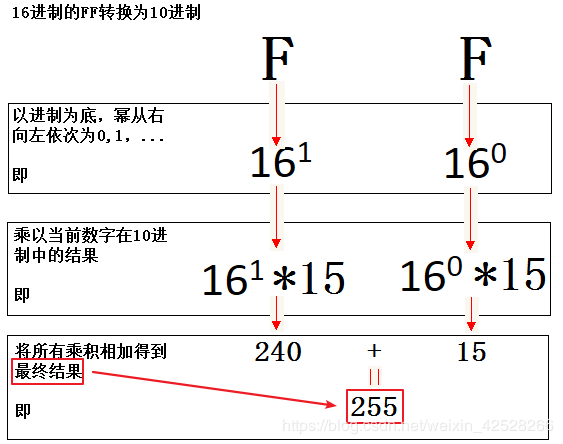
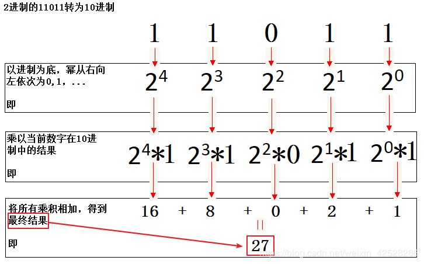
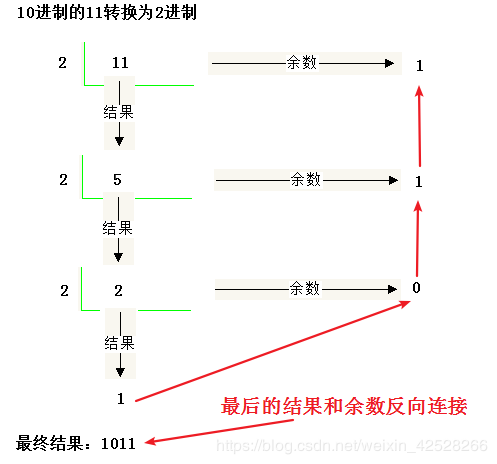

#计算机的进制
计算机内部的电子元器件只有两种状态，就是通电和断点，用1和0来表示，所以计算机内部只能传输1和0，也就是所谓的二进制。
我们原来学习的是十进制，逢十进一，十进制中有十个数字。我们以此类推，二进制就是逢二进一，二进制就两个数字，0和1。
八进制、十六进制也是同样的道理。
在计算机中，我们需要用到的进制有，二进制，八进制，十进制，十六进制。
进制       包含数字
二进制     0,1
八进制     0,1,2,3,4,5,6,7
十进制     0,1,2,3,4,5,6,7,8,9
十六进制    0,1,2,3,4,5,6,7,8,9,A,B,C,D,E,F

转成10进制：以进制为底，幂从右往左依次为0次方，1次方，2次方…，乘以当前当前数字在10进制中的结果，所有乘积相加
例：
1.16进制的FF转为10进制：

进制的11011转为10进制

10进制的11转2进制-----反向取余数

十进制转成十六进制：
Integer.toHexString(int i)
十进制转成八进制
Integer.toOctalString(int i)  
十进制转成二进制
Integer.toBinaryString(int i)
十六进制转成十进制
Integer.valueOf("FFFF",16).toString()
八进制转成十进制
Integer.valueOf("876",8).toString()
二进制转十进制
Integer.valueOf("0101",2).toString()

#有什么方法可以直接将2,8,16进制直接转换为10进制的吗?
java.lang.Integer类
parseInt(String s, int radix)
使用第二个参数指定的基数，将字符串参数解析为有符号的整数。
examples from jdk:
parseInt("0", 10) returns 0
parseInt("473", 10) returns 473
parseInt("-0", 10) returns 0
parseInt("-FF", 16) returns -255
parseInt("1100110", 2) returns 102
//int是4字节即32位时，最大数为(2^31)-1=2147483647，是10位数
//int是有符号的，范围是-2147483648~2147483647
parseInt("2147483647", 10) returns 2147483647
parseInt("-2147483648", 10) returns -2147483648 
parseInt("2147483648", 10) throws a NumberFormatException
parseInt("99",

throws a NumberFormatException
parseInt("Kona", 10) throws a NumberFormatException
parseInt("Kona", 27) returns 411787

#进制转换如何写（二，八，十六）不用算法
Integer.toBinaryString
Integer.toOctalString
Integer.toHexString
