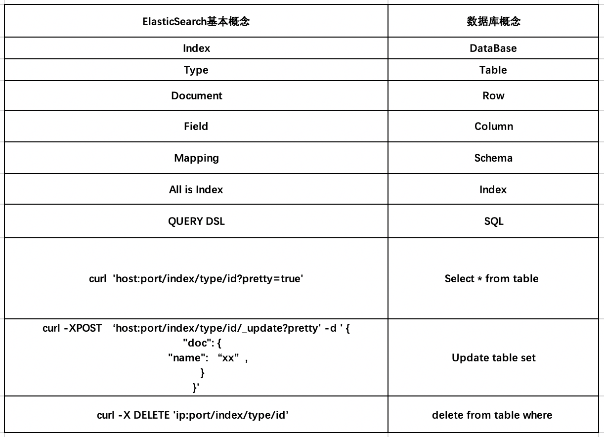

[ELK] 
ELK是Elasticsearch、Logstash、Kibana的简称，这三者是核心套件，但并非全部。
[Elasticsearch]是实时全文搜索和分析引擎，提供搜集、分析、存储数据三大功能；是一套开放REST和JAVA API等结构提供高效搜索功能，可扩展的分布式系统。
它构建于Apache Lucene搜索引擎库之上。
[Logstash]是一个用来搜集、分析、过滤日志的工具。它支持几乎任何类型的日志，包括系统日志、错误日志和自定义应用程序日志。
它可以从许多来源接收日志，这些来源包括 syslog、消息传递（例如 RabbitMQ）和JMX，它能够以多种方式输出数据，包括电子邮件、websockets和Elasticsearch。
[Kibana]是一个基于Web的图形界面，用于搜索、分析和可视化存储在 Elasticsearch指标中的日志数据。它利用Elasticsearch的REST接口来检索数据，
不仅允许用户创建他们自己的数据的定制仪表板视图，还允许他们以特殊的方式查询和过滤数据

[Elasticsearch]
Elasticsearch是一个开源的分布式、RESTFul 风格的搜索和数据分析引擎，它的底层是开源库Apache Lucene。
Lucene 可以说是当下最先进、高性能、全功能的搜索引擎库——无论是开源还是私有，但它也仅仅只是一个库。为了充分发挥其功能，你需要使用 Java 并将 Lucene 
直接集成到应用程序中。 更糟糕的是，您可能需要获得信息检索学位才能了解其工作原理，因为Lucene 非常复杂。
为了解决Lucene使用时的繁复性，于是Elasticsearch便应运而生。它使用 Java 编写，内部采用 Lucene 做索引与搜索，但是它的目标是使全文检索变得更简单，
简单来说，就是对Lucene 做了一层封装，它提供了一套简单一致的 RESTful API 来帮助我们实现存储和检索。
当然，Elasticsearch 不仅仅是 Lucene，并且也不仅仅只是一个全文搜索引擎。 它可以被下面这样准确地形容：
①一个分布式的实时文档存储，每个字段可以被索引与搜索；
②一个分布式实时分析搜索引擎；
③能胜任上百个服务节点的扩展，并支持 PB 级别的结构化或者非结构化数据。
由于Elasticsearch的功能强大和使用简单，维基百科、卫报、Stack Overflow、GitHub等都纷纷采用它来做搜索。现在，
Elasticsearch已成为全文搜索领域的主流软件之一。

[ElasticSearch的基本概念]/
[索引 index]
索引是ES存储数据的基本顶层单元目录.它好比就是关系型数据库中的数据库,是存储数据的地方。
当搜索数据的时候，会直接从索引中查取，注意这里要与关系型数据的中的索引区分,他们是完全不同的概念。
index的名字必须是小写,不能包含逗号、下划线或者大写字母
[类型 type]
type表示一类或者一种事物的抽象，在关系型数据库中我们经常将一类结构相似的数据放在一个表里，而在elasticsearch中,使用相同类型的type表示相同的一类事物，
它相当于关系型数据库中的表(table),用于描述文档中的各个字段的定义。每个type都有自己的映射(mapping)或者结构定义。
type的名字可以是大写或者小写,不能包含下划线或者逗号。
[文档 document]
document是index中的单条数据序列化成的json格式的数据，它以唯一id(_id)存储在ES中，相当于关系表的数据行，存储数据的载体，包含一个或多个存有数据的字段；
·字段（Field）：文档的一个Key/Value对；
·词（Term）：表示文本中的一个单词；
·标记（Token）：表示在字段中出现的词，由该词的文本、偏移量（开始和结束）以及类型组成
[Node 与 Cluster]
Elastic 本质上是一个分布式数据库，允许多台服务器协同工作，每台服务器可以运行多个 Elastic 实例。单个 Elastic 实例称为一个节点（node）。
一组节点构成一个集群（cluster）。
