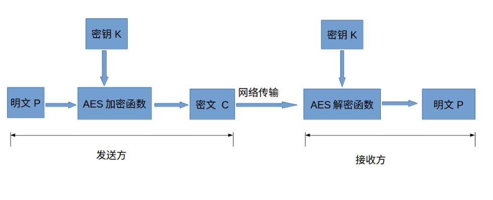
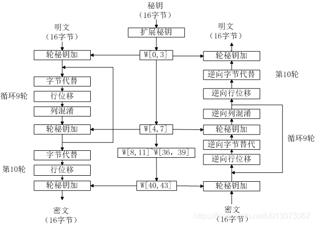

#AES
高级加密标准(AES)为最常见的对称加密算法。对称加密算法也就是加密和解密用相同的密钥，具体的加密流程如下图:

下面简单介绍下各个部分的作用与意义：
#明文P
没有经过加密的数据。
#密钥K
用来加密明文的密码，在对称加密算法中，加密与解密的密钥是相同的。密钥为接收方与发送方协商产生，但不可以直接在网络上传输，
否则会导致密钥泄漏，通常是通过非对称加密算法加密密钥，然后再通过网络传输给对方，或者直接面对面商量密钥。密钥是绝对不可以泄漏的，
否则会被攻击者还原密文，窃取机密数据。
#AES加密函数
设AES加密函数为E，则 C = E(K, P),其中P为明文，K为密钥，C为密文。也就是说，把明文P和密钥K作为加密函数的参数输入，则加密函数E会输出密文C。
#密文C
经加密函数处理后的数据
#AES解密函数
设AES解密函数为D，则 P = D(K, C),其中C为密文，K为密钥，P为明文。也就是说，把密文C和密钥K作为解密函数的参数输入，则解密函数会输出明文P。
在这里简单介绍下对称加密算法与非对称加密算法的区别。
#对称加密算法
加密和解密用到的密钥是相同的，这种加密方式加密速度非常快，适合经常发送数据的场合。缺点是密钥的传输比较麻烦。
#非对称加密算法
加密和解密用的密钥是不同的，这种加密方式是用数学上的难解问题构造的，通常加密解密的速度比较慢，适合偶尔发送数据的场合。
优点是密钥传输方便。常见的非对称加密算法为RSA、ECC和EIGamal。
实际中，一般是通过RSA加密AES的密钥，传输到接收方，接收方解密得到AES密钥，然后发送方和接收方用AES密钥来通信。

结论：
一个字等于多少个字节，与系统硬件（总线、cpu命令字位数等）有关，不应该毫无前提地说一个字等于多少位。
#位（Bit）与字节（Byte）
字 word
字节 byte
位 bit
字长是指字的长度

1字节=8位(1byte = 8bit)
1 kb = 1024 bytes =2^10 bytes
1 mb = 1024 kb = 2^20 bytes
1 gb = 1024 mb = 2^30 bytes
正确的说法:
①:
1字节（byte） = 8位（bit）
②:
在16位的系统中（比如8086微机） 1字 （word）= 2字节（byte）= 16（bit）
在32位的系统中（比如win32） 1字（word）= 4字节（byte）=32（bit）
在64位的系统中（比如win64）1字（word）= 8字节（byte）=64（bit）

AES为分组密码，分组密码也就是把明文分成一组一组的，每组长度相等，每次加密一组数据，直到加密完整个明文。
在AES标准规范中，分组长度只能是128位，也就是说，每个分组为16个字节（每个字节8位）。密钥的长度可以使用128位、192位或256位。
密钥的长度不同，推荐加密轮数也不同。AES-128，也就是密钥的长度为128位，加密轮数为10轮。
AES加密算法主要由4中操作组成：字节代替、行位移、列混淆、轮密钥加。
AES-128加密算法流程图
加密过程：首先明文进行1次轮密钥加；然后循环9轮字节代替、行位移、列混淆、轮密钥加；注意第10轮没有列混淆。
解密过程：解密过程与加密过程相反，这也是对称加密算法的特点。
首先密文进行1次轮密钥加:然后循环9轮逆向行位移、逆向字节代替、轮密钥加、逆向列混淆；注意第10轮没有逆向列混淆。

