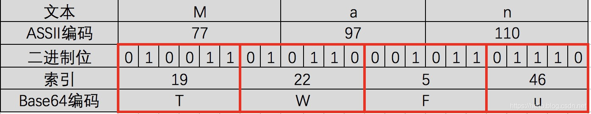
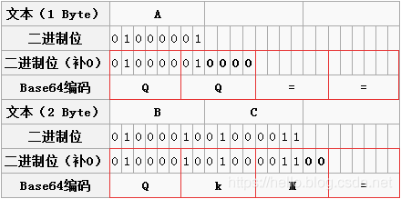

#Base64编码
目前Base64已经成为网络上常见的传输8Bit字节代码的编码方式之一。
在做支付系统时，系统之间的报文交互都需要使用Base64对明文进行转码，然后再进行签名或加密，之后再进行（或再次Base64）传输。
它是基于64个可打印的字符来表示二进制的数据的一种方法。
#Base64的编码原理
Base64的原理比较简单，每当我们使用Base64时都会先定义一个类似这样的数组:
['A', 'B', 'C', ... 'a', 'b', 'c', ... '0', '1', ... '+', '/']
上面就是Base64的索引表，字符选用了"A-Z、a-z、0-9、+、/" 64个可打印字符，这是标准的Base64协议规定。
在日常使用中我们还会看到“=”或“==”号出现在Base64的编码结果中，“=”在此是作为填充字符出现。
具体转换步骤
第一步，将待转换的字符串每三个字节分为一组，每个字节占8bit，那么共有24个二进制位。
第二步，将上面的24个二进制位每6个一组，共分为4组。
第三步，在每组前面添加两个0，每组由6个变为8个二进制位，总共32个二进制位，即四个字节。
第四步，根据Base64编码对照表（见下图）获得对应的值。
0　A　　17　R　　　34　i　　　51　z

1　B　　18　S　　　35　j　　　52　0

2　C　　19　T　　　36　k　　　53　1

3　D　　20　U　　　37　l　　　54　2

4　E　　21　V　　　38　m　　　55　3

5　F　　22　W　　　39　n　　　56　4

6　G　　23　X　　　40　o　　　57　5

7　H　　24　Y　　　41　p　　　58　6

8　I　　25　Z　　　42　q　　　59　7

9　J　　26　a　　　43　r　　　60　8

10　K　　27　b　　　44　s　　　61　9

11　L　　28　c　　　45　t　　　62　+

12　M　　29　d　　　46　u　　　63　/

13　N　　30　e　　　47　v

14　O　　31　f　　　48　w

15　P　　32　g　　　49　x

16　Q　　33　h　　　50　y

#示例说明
以下图的表格为示例，我们具体分析一下整个过程。

第一步：“M”、“a”、"n"对应的ASCII码值分别为77，97，110，对应的二进制值是01001101、01100001、01101110。
如图第二三行所示，由此组成一个24位的二进制字符串。
第二步：如图红色框，将24位每6位二进制位一组分成四组。
第三步：在上面每一组前面补两个0，扩展成32个二进制位，此时变为四个字节：00010011、00010110、00000101、00101110。分
别对应的值（Base64编码索引）为：19、22、5、46。
第四步：用上面的值在Base64编码表中进行查找，分别对应：T、W、F、u。因此“Man”Base64编码之后就变为：TWFu。

#位数不足情况
上面是按照三个字节来举例说明的，如果字节数不足三个，那么该如何处理？

两个字节：两个字节共16个二进制位，依旧按照规则进行分组。此时总共16个二进制位，每6个一组，则第三组缺少2位，用0补齐，得到三个Base64编码，第四组完全没有数据则用“=”补上。因此，上图中“BC”转换之后为“QKM=”；

一个字节：一个字节共8个二进制位，依旧按照规则进行分组。此时共8个二进制位，每6个一组，则第二组缺少4位，用0补齐，得到两个Base64编码，而后面两组没有对应数据，都用“=”补上。因此，上图中“A”转换之后为“QQ==”；

#注意事项
/大多数编码都是由字符串转化成二进制的过程，而Base64的编码则是从二进制转换为字符串。与常规恰恰相反。
/Base64编码主要用在传输、存储、表示二进制领域，不能算得上加密，只是无法直接看到明文。也可以通过打乱Base64编码来进行加密。
/中文有多种编码（比如：utf-8、gb2312、gbk等），不同编码对应Base64编码结果都不一样。
#延伸
上面我们已经看到了Base64就是用6位（2的6次幂就是64）表示字符，因此成为Base64。
同理，Base32就是用5位，Base16就是用4位。

