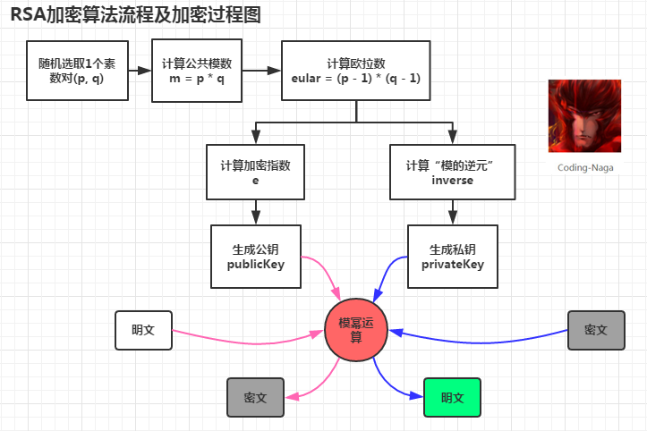
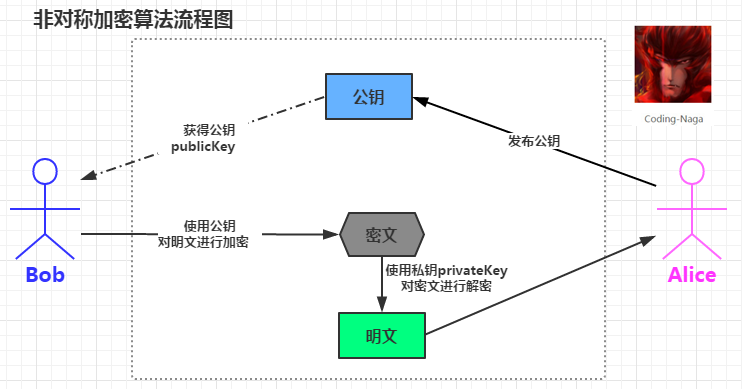

#RSA加密算法

RSA加密算法是一种非对称加密算法，所谓非对称，就是指该算法加密和解密使用不同的密钥，即使用加密密钥进行加密、解密密钥进行解密。
在RAS算法中，加密密钥（即公开密钥）PK是公开信息，而解密密钥（即秘密密钥）SK是需要保密的。

RSA算法通常是先生成一对RSA密钥，其中之一是保密密钥，由用户保存；另一个为公开密钥，可对外公开。
为提高保密强度，RSA密钥至少为500位长，一般推荐使用1024位。这就使加密的计算量很大。
为减少计算量，在传送信息时，常采用传统加密方法与公开密钥加密方法相结合的方式，即信息采用改进的DES或IDEA密钥加密，
然后使用RSA密钥加密对话密钥和信息摘要。对方收到信息后，用不同的密钥解密并可核对信息摘要。

#RSA加密过程
RSA的加密过程可以使用一个通式来表达：

也就是说RSA加密是对明文的E次方后除以N后求余数的过程。从通式可知，只要知道E和N任何人都可以进行RSA加密了，
所以说E、N是RSA加密的密钥，也就是说E和N的组合就是公钥，我们用(E,N)来表示公钥：

不过E和N不并不是随便什么数都可以的 ，它们都是经过严格的数学计算得出的，关于E和N拥有什么样的要求及其特性后面会讲到。
E是加密（Encryption）的首字母，N是数字（Number）的首字母。

#RAS解密过程
RSA的解密同样可以使用一个通式来表达：

也就是说对密文进行D次方后除以N的余数就是明文，这就是RSA解密过程。知道D和N就能进行解密密文了，所以D和N的组合就是私钥：

从上述可以看出RSA的加密方式和解密方式是相同的，加密是求“E次方的mod N”;解密是求“D次方的mod N”。
此处D是解密（Decryption）的首字母；N是数字（Number）的首字母。

小结下：
公钥	：（E，N）
私钥	：（D，N）
密钥对：（E，D，N）
加密 ：密文＝明文EmodN密文＝明文EmodN
解密 ：明文＝密文DmodN明文＝密文DmodN

在此可以看到，非对称加密是通过两个密钥（公钥-私钥）来实现对数据的加密和解密的。公钥用于加密，私钥用于解密。

#RSA算法优点：
不需要进行密钥传递，提高了安全性
可以进行数字签名认证（下面解释）
#RSA算法缺点：
产生密钥很麻烦，受到素数产生技术的限制，因而难以做到一次一密；
分组长度太大，为保证安全性，n 至少也要 600 bits 以上，使运算代价很高，尤其是速度较慢，

#签名消息
RSA也可以用来为一个消息署名。假如甲想给乙传递一个署名的消息的话，那么她可以为她的消息计算一个散列值(Message digest)，
然后用她的密钥(private key)加密这个散列值并将这个“署名”加在消息的后面。这个消息只有用她的公钥才能被解密。
乙获得这个消息后可以用甲的公钥解密这个散列值，然后将这个数据与他自己为这个消息计算的散列值相比较。
假如两者相符的话，那么他就可以知道发信人持有甲的密钥，以及这个消息在传播路径上没有被篡改过。