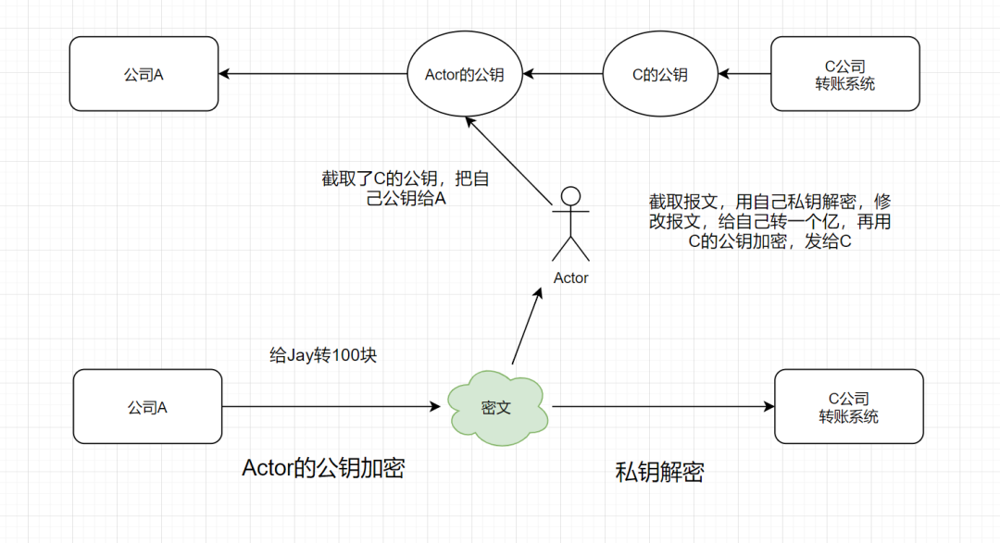

#加密算法的分类
1.对称加解密算法
a.通信双方同时掌握一个密钥，加密解密都是由一个密钥完成的（即加密密钥等于解密密钥，加解密密钥可以相互推倒出来）。
b.双方通信前共同拟定一个密钥，不对第三方公开。
c.不具有个体原子性，一个密钥被共享，泄漏几率增大
2.公私钥加解密算法
a.通信双方掌握不同的密钥，不同方向的加解密由不同的密钥完成。

#明文、密文、密钥、加密、解密
明文：指没有经过加密的信息/数据。
密文：明文被加密算法加密之后，会变成密文，以确保数据安全。
密钥：是一种参数，它是在明文转换为密文或将密文转换为明文的算法中输入的参数。密钥分为对称密钥与非对称密钥。
加密：将明文变成密文的过程。
解密：将密文还原为明文的过程。

#对称加密、非对称加密
对称加密：加密和解密使用相同密钥的加密算法

非对称加密：非对称加密算法需要两个密钥（公开密钥和私有密钥）。公钥与私钥是成对存在的，如果用公钥对数据进行加密，只有对应的私钥才能解密。

#什么是公钥私钥？
公钥与私钥是成对存在的密钥，如果用公钥对数据进行加密，只有用对应的私钥才能解密。
其实，公钥就是公开的秘钥，私钥就是要你私自保存好的秘钥。
非对称加密算法需要有一对公私钥~
假设你有一个文件，你用字母a加密，只有字母b才能解密;或者你用b加密，只有a才能解密，那么a和b就是一对公私钥。
如果密钥a公开，密钥b你就要私自保存好啦，这时候密钥a就是公钥，密钥b就是私钥。
相反，如果b公开，a就要保存好，这时候呢，秘钥b就是公钥，秘钥a就是私钥。

#加签验签概念
「加签」：用Hash函数把原始报文生成报文摘要，然后用私钥对这个摘要进行加密，就得到这个报文对应的数字签名。
通常来说呢，请求方会把「数字签名和报文原文」一并发送给接收方。

「验签」：接收方拿到原始报文和数字签名后，用「同一个Hash函数」从报文中生成摘要A。
另外，用对方提供的公钥对数字签名进行解密，得到摘要B，对比A和B是否相同，就可以得知报文有没有被篡改过。

#为什么需要加签验签
那么，为什么需要加签和验签呢？接下来呢，举个demo吧。
假设现在有A公司，要接入C公司的转账系统。在一开始呢，C公司把自己的公钥寄给A公司，自己收藏好私钥。
A公司这边的商户，发起转账时，A公司先用C公司的公钥，对请求报文加密，加密报文到达C公司的转账系统时，C公司就用自己的私钥把报文揭开。
假设在加密的报文在传输过程中，被中间人Actor获取了，他也郁闷，因为他没有私钥，看着天鹅肉，又吃不了。
本来想修改报文，给自己账号转一个亿的，哈哈。 这个实现方式看起来是天衣无缝，稳得一匹的。

但是呢，如果一开始，C公司把公钥发给公司A的时候，就被中间人Actor获取到呢，酱紫就出问题了。
中间人Actor截取了C的公钥，他把自己的公钥发给了A公司，A误以为这就是C公司的公钥。A在发起转账时，用Actor的公钥，对请求报文加密，
加密报文到在传输过程，Actor又截取了，这时候，他用自己的私钥解密，然后修改了报文（给自己转一个亿），再用C的公钥加密，发给C公司，
C公司收到报文后，继续用自己的私钥解密。最后是不是A公司的转账账户损失了一个亿呢~

C公司是怎么区分报文是不是来自A呢，还是被中间人修改过呢？为了表明身份和报文真实性，这就需要「加签验签」啦！
A公司把自己的公钥也发送给C公司，私钥自己保留着。在发起转账时，先用自己的私钥对请求报文加签，于是得到自己的数字签名。
再把数字签名和请求报文一起发送给C公司。C公司收到报文后，拿A的公钥进行验签，如果原始报文和数字签名的摘要内容不一致，那就是报文被篡改啦~

有些朋友可能有疑问，假设A在发自己的公钥给C公司的时候，也被中间人Actor截取了呢。
嗯嗯，我们来模拟一波Actor又截取了公钥，看看Actor能干出什么事情来~哈哈
假设Actor截取到A的公钥后，随后也截取了到A发往C的报文。他截取到报文后，第一件想做的事肯定是修改报文内容。
但是如果单单修改原始报文是不可以的，因为发过去C公司肯定验签不过啦。
但是呢，数字签名似乎解不开，因为消息摘要算法（hash算法）无法逆向解开的， 只起验证的作用呢....

#常见加密相关算法简介
消息摘要算法
对称加密算法
非对称加密算法
国密算法
#1 消息摘要算法
相同的明文数据经过相同的消息摘要算法会得到相同的密文结果值。
数据经过消息摘要算法处理，得到的摘要结果值，是无法还原为处理前的数据的。
数据摘要算法也被称为哈希（Hash）算法或散列算法。
消息摘要算法一般用于签名验签。
消息摘要算法主要分三类：MD（息摘要算法）、SHA（安全散列算法）和MAC（消息认证码算法）

#1.1 MD家族算法
MD（Message Digest，消息摘要算法）家族，包括MD2，MD4，MD5。

MD2，MD4，MD5 计算的结果都是是一个128位（即16字节）的散列值，用于确保信息传输完整一致。
MD2的算法较慢但相对安全，MD4速度很快，但安全性下降，MD5则比MD4更安全、速度更快。
MD5被广泛应用于数据完整性校验、数据（消息）摘要、数据加密等。
MD5，可以被破解，对于需要高度安全性的数据，专家一般建议改用其他算法，如SHA-2。
2004年，证实MD5算法无法防止碰撞攻击，因此不适用于安全性认证，如SSL公开密钥认证或是数字签名等用途。
举个例子，看看如何获取字符串的MD5值吧: MD5Test.java

#ShA家族算法
SHA（Secure Hash Algorithm，安全散列算法），包括SHA-0、SHA-1、SHA-2(SHA-256,SHA-512,SHA-224,SHA-384等)、SHA-3。
它是在MD算法基础上实现的，与MD算法区别在于「摘要长度」，SHA 算法的摘要「长度更长，安全性更高」。

SHA-0发布之后很快就被NSA撤回，因为含有会降低密码安全性的错误，它是SHA-1的前身。
SHA-1在许多安全协议中广为使用，包括TLS、GnuPG、SSH、S/MIME和IPsec，是MD5的后继者。
SHA-2包括SHA-224、SHA-256、SHA-384、SHA-512、SHA-512/224、SHA-512/256。它的算法跟SHA-1基本上相似，目前还没有出现明显弱点。
SHA-3是2015年正式发布，由于对「MD5出现成功的破解」，以及对SHA-0和SHA-1出现理论上破解的方法，SHA-3应运而生。
它与之前算法不同的是，它是可替换的加密散列算法。

#对称加密算法
加密和解密使用「相同密钥」的加密算法就是对称加密算法。常见的对称加密算法有AES、3DES、DES、RC5、RC6等。
#DES
数据加密标准（英语：Data Encryption Standard，缩写为 DES）是一种对称密钥加密块密码算法。DES算法的入口参数有三个：Key、Data、Mode。
-Key: 7个字节共56位，是DES算法的工作密钥；
-Data: 8个字节64位，是要被加密或被解密的数据；
-Mode: 加密或解密。
#3DES
三重数据加密算法（英语：Triple Data Encryption Algorithm，又称3DES（Triple DES），是一种对称密钥加密块密码，
相当于是对每个数据块应用三次数据加密标准（DES）算法。
#AES
AES，高级加密标准（英语：Advanced Encryption Standard），在密码学中又称Rijndael加密法，是美国联邦政府采用的一种区块加密标准。
-采用对称分组密码体制，密钥长度为 128 位、 192 位、256 位，分组长度128位
-相对于DES ，AES具有更好的 安全性、效率 和 灵活性。

#非对称加密算法
非对称加密算法需要两个密钥：公钥和私钥。公钥与私钥是成对存在的，如果用公钥对数据进行加密，只有用对应的私钥才能解密。
主要的非对称加密算法有：RSA、Elgamal、DSA、D-H、ECC。
#RSA算法
-RSA加密算法是一种非对称加密算法,广泛应用于加密和数字签名
-RSA算法原理：两个大素数的乘积进行因式分解却极其困难，因此可以将乘积公开作为加密密钥。
-RSA是被研究得最广泛的公钥算法，从提出到现在，经历了各种攻击的考验，普遍认为是目前最优秀的公钥方案之一。
#DSA
-DSA(Digital Signature Algorithm,数字签名算法),也是一种非对称加密算法。
-DSA和RSA区别在，DSA仅用于数字签名，不能用于数据加密解密。其安全性和RSA相当，但其性能要比RSA好。
#ECC 算法
-ECC（Elliptic Curves Cryptography，椭圆曲线密码编码学），基于椭圆曲线加密。
-Ecc主要优势是，在某些情况下，它比其他的方法使用更小的密钥，比如RSA加密算法，提供相当的或更高等级的安全级别。
-它的一个缺点是，加密和解密操作的实现比其他机制时间长 (相比RSA算法，该算法对CPU 消耗严重)。