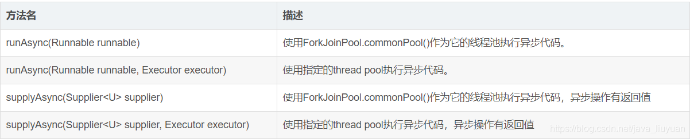

#Async
引言： 在Java应用中，绝大多数情况下都是通过同步的方式来实现交互处理的；但是在处理与第三方系统交互的时候，容易造成响应迟缓的情况，
之前大部分都是使用多线程来完成此类任务，其实，在spring 3.x之后，就已经内置了@Async来完美解决这个问题。
1.  何为异步调用？
    在解释异步调用之前，我们先来看同步调用的定义；同步就是整个处理过程顺序执行，当各个过程都执行完毕，并返回结果。 
    异步调用则是只是发送了调用的指令，调用者无需等待被调用的方法完全执行完毕；而是继续执行下面的流程。

    例如， 在某个调用中，需要顺序调用 A, B, C三个过程方法；如他们都是同步调用，则需要将他们都顺序执行完毕之后，方算作过程执行完毕； 
    如B为一个异步的调用方法，则在执行完A之后，调用B，并不等待B完成，而是执行开始调用C，待C执行完毕之后，就意味着这个过程执行完毕了。
2.  常规的异步调用处理方式
    在Java中，一般在处理类似的场景之时，都是基于创建独立的线程去完成相应的异步调用逻辑，通过主线程和不同的线程之间的执行流程，
    从而在启动独立的线程之后，主线程继续执行而不会产生停滞等待的情况。

在Spring中，基于@Async标注的方法，称之为异步方法；这些方法将在执行的时候，将会在独立的线程中被执行， 
调用者无需等待它的完成， 即可继续其他的操作。

#如何在Spring中启用@Async
1、基于Java配置的启用方式：
@Configuration  
@EnableAsync  
public class SpringAsyncConfig { ... }  

springboot中的配置是：
@EnableSwagger2
@EnableAsync
@EnableTransactionManagement
public class SettlementApplication {
public static void main(String[] args) {
    SpringApplication.run(SettlementApplication.class, args);
    }
}

2、基于XML配置文件的启用方式，配置如下：
<task:executor id="myexecutor" pool-size="5"  />  
<task:annotation-driven executor="myexecutor"/>  
以上就是两种定义的方式。

#注意事项，以下情况会使@Async失效；
异步方法使用static修饰 ；
异步类没有使用@Component注解（或其他注解）导致spring无法扫描到异步类；
类中需要使用@Autowired或@Resource等注解自动注入，不能自己手动new对象；
如果使用SpringBoot框架必须在启动类中增加@EnableAsync注解 ；
在Async方法上标注@Transactional是没用的。 在Async 方法调用的方法上标注@Transactional 有效；

#CompletableFuture介绍
Future模式的缺点；
-Future虽然可以实现获取异步执行结果的需求，但是它没有提供通知机制，我们无法得知Future什么时候完成；
-Future是Java 5添加的类，用来描述一个异步计算的结果，但是获取一个结果时方法较少,要么通过轮询isDone，确认完成后，调用get()获取值，
要么调用get()设置一个超时时间。但是这个get()方法会阻塞住调用线程，这种阻塞的方式显然和我们的异步编程的初衷相违背。

CompletableFuture介绍；
-CompletableFuture能够将回调放到与任务不同的线程中执行，也能将回调作为继续执行的同步函数，在与任务相同的线程中执行。
它避免了传统回调最大的问题，那就是能够将控制流分离到不同的事件处理器中。
-CompletableFuture弥补了Future模式的缺点。在异步的任务完成后，需要用其结果继续操作时，无需等待。
可以直接通过thenAccept、thenApply、thenCompose等方式将前面异步处理的结果交给另外一个异步事件处理线程来处理。
CompletableFuture的方法介绍；
CompletableFuture的静态工厂方法

runAsync 和 supplyAsync 方法的区别是runAsync没有返回值；

-进行变换
public <U> CompletableFuture<U> thenApply(Function<? super T,? extends U> fn);
public <U> CompletableFuture<U> thenApplyAsync(Function<? super T,? extends U> fn);
public <U> CompletableFuture<U> thenApplyAsync(Function<? super T,? extends U> fn,Executor executor);
首先说明一下已Async结尾的方法都是可以异步执行的，如果指定了线程池，会在指定的线程池中执行，如果没有指定，
默认会在ForkJoinPool.commonPool()中执行，下文中将会有好多类似的，都不详细解释了。
关键的入参只有一个Function，它是函数式接口，所以使用Lambda表示起来会更加优雅。它的入参是上一个阶段计算后的结果，返回值是经过转化后结果。
-进行消耗
public CompletableFuture<Void> thenAccept(Consumer<? super T> action);
public CompletableFuture<Void> thenAcceptAsync(Consumer<? super T> action);
public CompletableFuture<Void> thenAcceptAsync(Consumer<? super T> action,Executor executor);
thenAccept是针对结果进行消耗，因为他的入参是Consumer，有入参无返回值。
