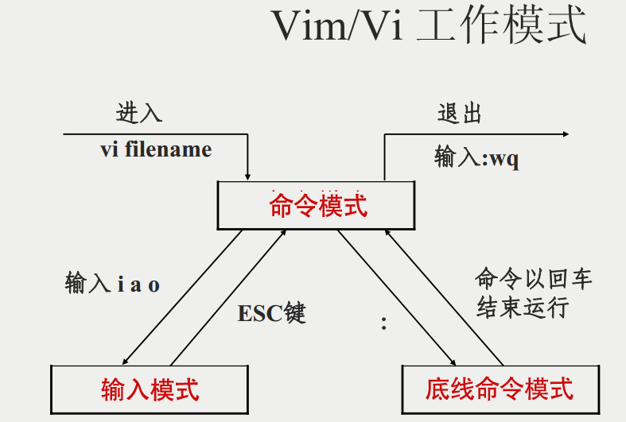
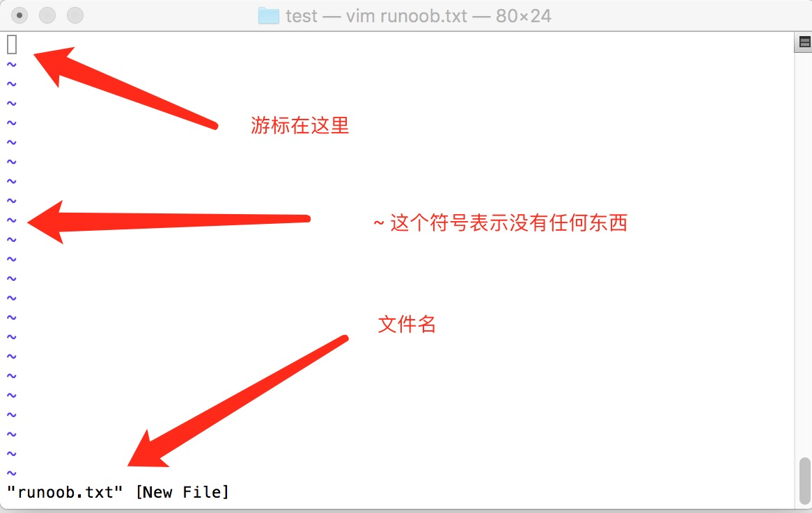
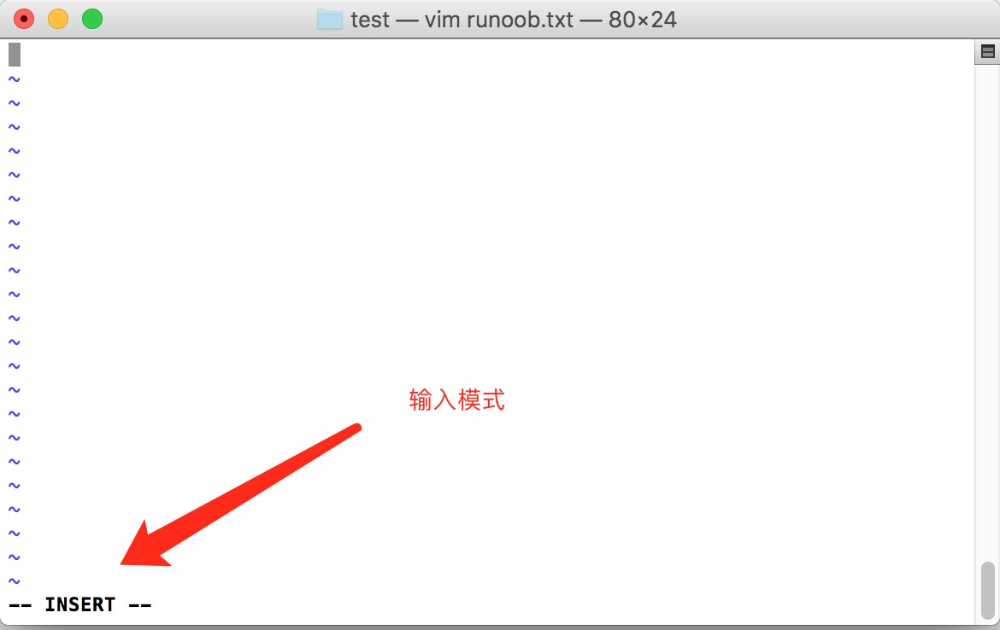
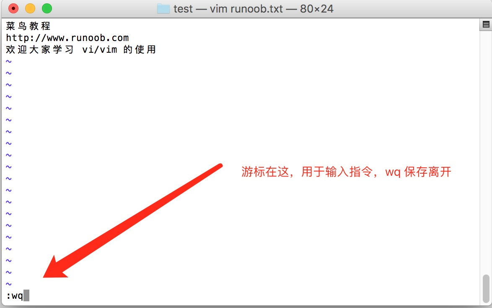
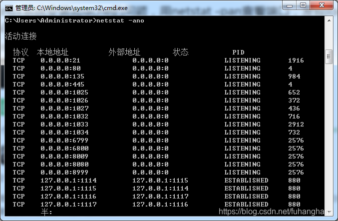

#处理目录的常用命令
ls: 列出目录及文件名
cd: 切换目录
pwd: 显示目前的目录
mkdir: 创建一个新的目录
rmdir: 删除一个空的目录,如果不是空的目录需要用rm -rf +文件夹名
cp: 复制文件或目录
rm: 删除文件或目录 rm +文件名,rm -rf +文件夹名
mv: 移动文件与目录，或修改文件与目录的名称

#Linux 文件内容查看
cat:   由第一行开始显示文件内容
tac:   从最后一行开始显示，可以看出 tac 是 cat 的倒着写！
nl:    显示的时候，顺道输出行号！
more:  一页一页的显示文件内容
less:  与 more 类似，但是比 more 更好的是，他可以往前翻页！
head:  只看头几行
tail:  只看尾巴几行

#Linux 磁盘管理
Linux 磁盘管理好坏直接关系到整个系统的性能问题。
Linux 磁盘管理常用三个命令为 df、du 和 fdisk。
df（英文全称：disk full）：列出文件系统的整体磁盘使用量
du（英文全称：disk used）：检查磁盘空间使用量
fdisk：用于磁盘分区

#Linux vi/vim
Vim是从 vi 发展出来的一个文本编辑器。代码补完、编译及错误跳转等方便编程的功能特别丰富，在程序员中被广泛使用。
简单的来说， vi 是老式的字处理器，不过功能已经很齐全了，但是还是有可以进步的地方。 vim 则可以说是程序开发者的一项很好用的工具。
vi/vim 的使用
基本上 vi/vim 共分为三种模式，分别是命令模式（Command mode），输入模式（Insert mode）和底线命令模式（Last line mode）。 这三种模式的作用分别是：
命令模式：
用户刚刚启动 vi/vim，便进入了命令模式。
此状态下敲击键盘动作会被Vim识别为命令，而非输入字符。比如我们此时按下i，并不会输入一个字符，i被当作了一个命令。
以下是常用的几个命令：
i 切换到输入模式，以输入字符。
x 删除当前光标所在处的字符。
: 切换到底线命令模式，以在最底一行输入命令。
若想要编辑文本：启动Vim，进入了命令模式，按下i，切换到输入模式。
命令模式只有一些最基本的命令，因此仍要依靠底线命令模式输入更多命令。
输入模式
在命令模式下按下i就进入了输入模式。
在输入模式中，可以使用以下按键：
字符按键以及Shift组合，输入字符
ENTER，回车键，换行
BACK SPACE，退格键，删除光标前一个字符
DEL，删除键，删除光标后一个字符
方向键，在文本中移动光标
HOME/END，移动光标到行首/行尾
Page Up/Page Down，上/下翻页
Insert，切换光标为输入/替换模式，光标将变成竖线/下划线
ESC，退出输入模式，切换到命令模式
底线命令模式
在命令模式下按下:（英文冒号）就进入了底线命令模式。
底线命令模式可以输入单个或多个字符的命令，可用的命令非常多。
在底线命令模式中，基本的命令有（已经省略了冒号）：
q 退出程序
w 保存文件
按ESC键可随时退出底线命令模式。
简单的说，我们可以将这三个模式想成底下的图标来表示：

vi/vim 使用实例
使用 vi/vim 进入一般模式
如果你想要使用 vi 来建立一个名为 runoob.txt 的文件时，你可以这样做：
$ vim runoob.txt
直接输入 vi 文件名 就能够进入 vi 的一般模式了。请注意，记得 vi 后面一定要加文件名，不管该文件存在与否！

按下 i 进入输入模式(也称为编辑模式)，开始编辑文字
在一般模式之中，只要按下 i, o, a 等字符就可以进入输入模式了！
在编辑模式当中，你可以发现在左下角状态栏中会出现 –INSERT- 的字样，那就是可以输入任意字符的提示。
这个时候，键盘上除了 Esc 这个按键之外，其他的按键都可以视作为一般的输入按钮了，所以你可以进行任何的编辑。

按下 ESC 按钮回到一般模式
好了，假设我已经按照上面的样式给他编辑完毕了，那么应该要如何退出呢？是的！没错！就是给他按下 Esc 这个按钮即可！马上你就会发现画面左下角的 – INSERT – 不见了！
在一般模式中按下 :wq 储存后离开 vi
OK，我们要存档了，存盘并离开的指令很简单，输入 :wq 即可保存离开！

#Linux yum 命令
yum是一个在 Fedora 和 RedHat 以及 SUSE 中的 Shell 前端软件包管理器。
基于 RPM 包管理，能够从指定的服务器自动下载 RPM 包并且安装，可以自动处理依赖性关系，并且一次安装所有依赖的软件包，无须繁琐地一次次下载、安装。
yum 提供了查找、安装、删除某一个、一组甚至全部软件包的命令，而且命令简洁而又好记。
#yum常用命令
1. 列出所有可更新的软件清单命令：yum check-update
2. 更新所有软件命令：yum update
3. 仅安装指定的软件命令：yum install <package_name>
4. 仅更新指定的软件命令：yum update <package_name>
5. 列出所有可安裝的软件清单命令：yum list
6. 删除软件包命令：yum remove <package_name>
7. 查找软件包命令：yum search <keyword>
8. 清除缓存命令:
yum clean packages: 清除缓存目录下的软件包
yum clean headers: 清除缓存目录下的 headers
yum clean oldheaders: 清除缓存目录下旧的 headers
yum clean, yum clean all (= yum clean packages; yum clean oldheaders) :清除缓存目录下的软件包及旧的 headers
   
#Linux apt 命令
apt（Advanced Packaging Tool）是一个在 Debian 和 Ubuntu 中的 Shell 前端软件包管理器。
apt 命令提供了查找、安装、升级、删除某一个、一组甚至全部软件包的命令，而且命令简洁而又好记。
apt 命令执行需要超级管理员权限(root)。
#apt 常用命令
列出所有可更新的软件清单命令：sudo apt update
升级软件包：sudo apt upgrade
列出可更新的软件包及版本信息：apt list --upgradeable
升级软件包，升级前先删除需要更新软件包：sudo apt full-upgrade
安装指定的软件命令：sudo apt install <package_name>
安装多个软件包：sudo apt install <package_1> <package_2> <package_3>
更新指定的软件命令：sudo apt update <package_name>
显示软件包具体信息,例如：版本号，安装大小，依赖关系等等：sudo apt show <package_name>
删除软件包命令：sudo apt remove <package_name>
清理不再使用的依赖和库文件: sudo apt autoremove
移除软件包及配置文件: sudo apt purge <package_name>
查找软件包命令： sudo apt search <keyword>
列出所有已安装的包：apt list --installed
列出所有已安装的包的版本信息：apt list --all-versions、

#Linux find 命令
Linux find 命令用来在指定目录下查找文件。任何位于参数之前的字符串都将被视为欲查找的目录名。
如果使用该命令时，不设置任何参数，则 find 命令将在当前目录下查找子目录与文件。并且将查找到的子目录和文件全部进行显示。
#实例
将当前目录及其子目录下所有文件后缀为 .c 的文件列出来:
# find . -name "*.c"
将当前目录及其子目录中的所有文件列出：
# find . -type f
将当前目录及其子目录下所有最近 20 天内更新过的文件列出:
# find . -ctime -20
查找 /var/log 目录中更改时间在 7 日以前的普通文件，并在删除之前询问它们：
# find /var/log -type f -mtime +7 -ok rm {} \;
查找当前目录中文件属主具有读、写权限，并且文件所属组的用户和其他用户具有读权限的文件：
# find . -type f -perm 644 -exec ls -l {} \;
查找系统中所有文件长度为 0 的普通文件，并列出它们的完整路径：
# find / -type f -size 0 -exec ls -l {} \;
# xargs 结合 find 使用
用 rm 删除太多的文件时候，可能得到一个错误信息：/bin/rm Argument list too long. 用 xargs 去避免这个问题：
# find . -type f -name "*.log" -print0 | xargs -0 rm -f
xargs -0 将 \0 作为定界符。
统计一个源代码目录中所有 php 文件的行数：
# find . -type f -name "*.php" -print0 | xargs -0 wc -l
查找所有的 jpg 文件，并且压缩它们：
# find . -type f -name "*.jpg" -print | xargs tar -czvf images.tar.gz

#Linux用netstat查看服务及监听端口
netstat -ano来显示协议统计信息和TCP/IP网络连接
netstat -t/-u/-l/-r/-n【显示网络相关信息,-t:TCP协议,-u:UDP协议,-l:监听,-r:路由,-n:显示IP地址和端口号】
netstat -tlun【查看本机监听的端口】
netstat -an【查看本机所有的网络】
netstat -rn【查看本机路由表】
列出所有端口：netstat -a
列出所有的TCP端口：netstat -at
列出所有的UDP端口：netstat -au
列出所有处于监听状态的socket：netstat -l
列出所有监听TCP端口的socket：netstat -lt
列出所有监听UDP端口的socket：netstat -lu
找出程序运行的端口：netstat -ap | grep ssh
找出运行在指定端口的进程：netstat -an | grep ‘:80’

State有如下状态:
        CLOSED 
                初始（无连接）状态。
        LISTENING 
                侦听状态，等待远程机器的连接请求。
        SYN_SEND 
                在TCP三次握手期间，主动连接端发送了SYN包后，进入SYN_SEND状态，等待对方的ACK包。（SYN：synchronous 同步，ACK：acknowledgement 确认）
        SYN_RECV 
                在TCP三次握手期间，主动连接端收到SYN包后，进入SYN_RECV状态。（RECV：receiver 收到）
        ESTABLISHED （建立）
                完成TCP三次握手后，主动连接端进入ESTABLISHED状态。此时，TCP连接已经建立，可以进行通信。
        FIN_WAIT_1 
                在TCP四次挥手时，主动关闭端发送FIN包后，进入FIN_WAIT_1状态。（FIN：finish 结束）
        FIN_WAIT_2 
                在TCP四次挥手时，主动关闭端收到ACK包后，进入FIN_WAIT_2状态。
        TIME_WAIT 
                在TCP四次挥手时，主动关闭端发送了ACK包之后，进入TIME_WAIT状态，等待最多MSL时间，让被动关闭端收到ACK包。
        CLOSING 
                在TCP四次挥手期间，主动关闭端发送了FIN包后，没有收到对应的ACK包，却收到对方的FIN包，此时，进入CLOSING状态。
        CLOSE_WAIT 
                在TCP四次挥手期间，被动关闭端收到FIN包后，进入CLOSE_WAIT状态。
        LAST_ACK 
                在TCP四次挥手时，被动关闭端发送FIN包后，进入LAST_ACK状态，等待对方的ACK包。
主动连接端可能的状态有：
        CLOSED        SYN_SEND        ESTABLISHED。
主动关闭端可能的状态有：
        FIN_WAIT_1        FIN_WAIT_2        TIME_WAIT。
被动连接端可能的状态有：
        LISTEN        SYN_RECV        ESTABLISHED。
被动关闭端可能的状态有：
        CLOSE_WAIT        LAST_ACK        CLOSED。
#重点说明
0.0.0.0 是对外开放，通过服务域名、ip可以访问的端口
127.0.0.1 只能对本机 localhost访问，也是保护此端口安全性
::: 这三个: 的前两个”::“，是“0:0:0:0:0:0:0:0”的缩写，相当于IPv6的“0.0.0.0”，就是本机的所有IPv6地址，第三个:是IP和端口的分隔符

#Linux ps 命令
Linux ps 命令用于显示当前进程的状态，类似于 windows 的任务管理器。
查找指定进程格式: ps -ef | grep 进程关键字 
# ps -ef | grep php

#Linux kill命令
Linux kill 命令用于删除执行中的程序或工作。n
kill 可将指定的信息送至程序。预设的信息为 SIGTERM(15)，可将指定程序终止。
若仍无法终止该程序，可使用 SIGKILL(9) 信息尝试强制删除程序。程序或工作的编号可利用 ps 指令或 jobs 指令查看。
杀死进程
# kill 12345
强制杀死进程
# kill -KILL 123456
彻底杀死进程
# kill -9 123456

#ftp 登录
ftp 128.1.52.10

