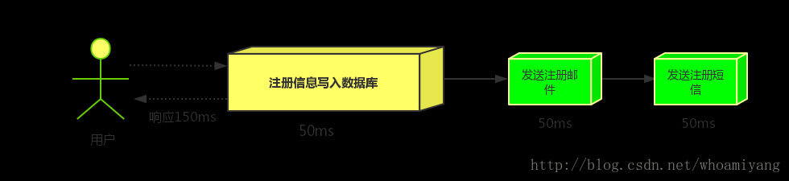
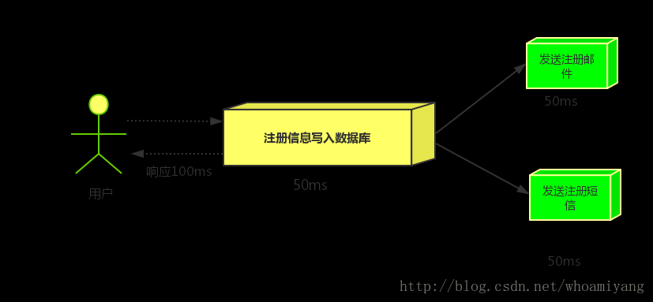
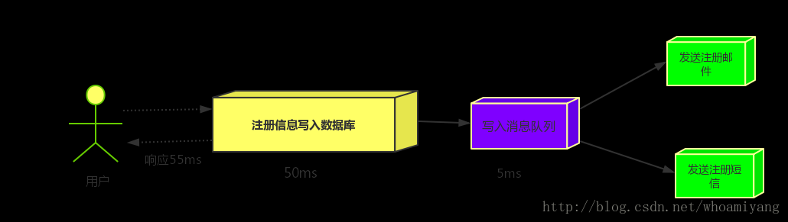
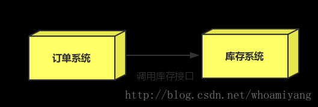
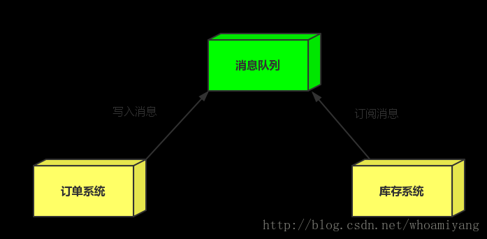
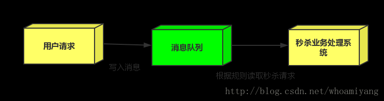

1.首先我们简单了解一下消息中间件的应用场景  

异步处理   
场景说明：用户注册后，需要发注册邮件和注册短信,传统的做法有两种1.串行的方式;2.并行的方式    
(1)串行方式:将注册信息写入数据库后,发送注册邮件,再发送注册短信,以上三个任务全部完成后才返回给客户端。     
          这有一个问题是,邮件,短信并不是必须的,它只是一个通知,而这种做法让客户端等待没有必要等待的东西.   
  

(2)并行方式:将注册信息写入数据库后,发送邮件的同时,发送短信,以上三个任务完成后,返回给客户端,并行的方式能提高处理的时间。   
  
假设三个业务节点分别使用50ms,串行方式使用时间150ms,并行使用时间100ms。 虽然并性已经提高的处理时间,   
但是,前面说过,邮件和短信对我正常的使用网站没有任何影响，客户端没有必要等着其发送完成才显示注册成功,应该是写入数据库后就返回.   

(3)消息队列   
引入消息队列后，把发送邮件,短信不是必须的业务逻辑异步处理   
  
由此可以看出,引入消息队列后，用户的响应时间就等于写入数据库的时间+写入消息队列的时间(可以忽略不计),引入消息队列后处理后,响应时间是串行的3倍,是并行的2倍。   

应用解耦   

场景：双11是购物狂节,用户下单后,订单系统需要通知库存系统,传统的做法就是订单系统调用库存系统的接口.   
  
这种做法有一个缺点:     
 *当库存系统出现故障时,订单就会失败。     
 *订单系统和库存系统高耦合.     
  引入消息队列   
  

 *订单系统:用户下单后,订单系统完成持久化处理,将消息写入消息队列,返回用户订单下单成功。     
 *库存系统:订阅下单的消息,获取下单消息,进行库操作。     
  就算库存系统出现故障,消息队列也能保证消息的可靠投递,不会导致消息丢失。     

流量削峰   

流量削峰一般在秒杀活动中应用广泛   
场景:秒杀活动，一般会因为流量过大，导致应用挂掉,为了解决这个问题，一般在应用前端加入消息队列。  
作用:  
1.可以控制活动人数，超过此一定阀值的订单直接丢弃(我为什么秒杀一次都没有成功过呢^^)   

2.可以缓解短时间的高流量压垮应用(应用程序按自己的最大处理能力获取订单)   
   

1.用户的请求,服务器收到之后,首先写入消息队列,加入消息队列长度超过最大值,则直接抛弃用户请求或跳转到错误页面.       
2.秒杀业务根据消息队列中的请求信息，再做后续处理.   
