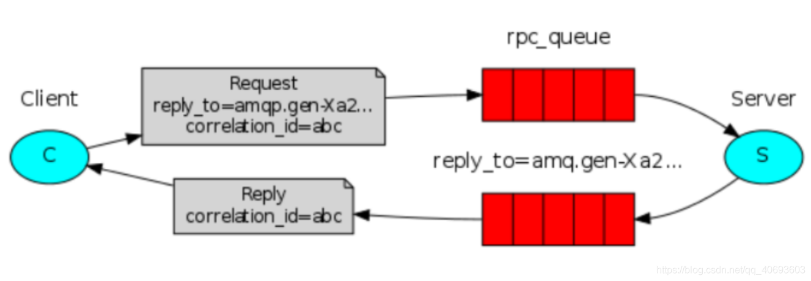

一、系统架构

几个概念说明:
Broker:它提供一种传输服务,它的角色就是维护一条从生产者到消费者的路线，保证数据能按照指定的方式进行传输,   
Exchange：消息交换机,它指定消息按什么规则,路由到哪个队列。  
Queue:消息的载体,每个消息都会被投到一个或多个队列。  
Binding:绑定，它的作用就是把exchange和queue按照路由规则绑定起来.  
Routing Key:路由关键字,exchange根据这个关键字进行消息投递。  
vhost:虚拟主机,一个broker里可以有多个vhost，用作不同用户的权限分离。  
Producer:消息生产者,就是投递消息的程序.  
Consumer:消息消费者,就是接受消息的程序.  
Channel:消息通道,在客户端的每个连接里,可建立多个channel.  

二、MQ的应用场景  
1、消息异步通知(注册时邮箱认证、添加商品生成详情页和将商品添加到搜索库等)  
2、应用解耦 
3、流量削峰

三、六种工作模式  
1.1 simple简单模式  
  
1）消息产生后将消息放入队列  
2）消息的消费者(consumer) 监听(while) 消息队列,如果队列中有消息,就消费掉,消息被拿走后,自动从队列中删除(隐患 消息可能没有被消费者正确处理,已经从队列中消失了,造成消息的丢失)应用场景:聊天(中间有一个过度的服务器;p端,c端)  

1.2 work工作模式(资源的竞争)  
  
1）消息产生者将消息放入队列消费者可以有多个,消费者1,消费者2,同时监听同一个队列,消息被消费?C1 C2共同争抢当前的消息队列内容,谁先拿到谁负责消费消息(隐患,高并发情况下,默认会产生某一个消息被多个消费者共同使用,可以设置一个开关(syncronize,与同步锁的性能不一样。保证一条消息只能被一个消费者使用)  
2）应用场景:红包;大项目中的资源调度(任务分配系统不需知道哪一个任务执行系统在空闲,直接将任务扔到消息队列中,空闲的系统自动争抢)  

1.3 publish/subscribe发布订阅(共享资源)  
  
1）X代表交换机rabbitMQ内部组件,erlang 消息产生者是代码完成,代码的执行效率不高,消息产生者将消息放入交换机,交换机发布订阅把消息发送到所有消息队列中,对应消息队列的消费者拿到消息进行消费  
2）相关场景:邮件群发,群聊天,广播(广告)  

1.4 routing路由模式  
  
1）消息生产者将消息发送给交换机按照路由判断,路由是字符串(info) 当前产生的消息携带路由字符(对象的方法),交换机根据路由的key,只能匹配上路由key对应的消息队列,对应的消费者才能消费消息  
2）根据业务功能定义路由字符串  
3）从系统的代码逻辑中获取对应的功能字符串,将消息任务扔到对应的队列中业务场景:error 通知;EXCEPTION;错误通知的功能;传统意义的错误通知;客户通知;利用key路由,可以将程序中的错误封装成消息传入到消息队列中,开发者可以自定义消费者,实时接收错误  

1.5 topic 主题模式(路由模式的一种)  
  
1）星号井号代表通配符  
2）星号代表多个单词,井号代表一个单词  
3）路由功能添加模糊匹配  
4）消息产生者产生消息,把消息交给交换机  
5）交换机根据key的规则模糊匹配到对应的队列,由队列的监听消费者接收消息消费  

1.6 RPC  
  
RPC即客户端远程调用服务端的方法 ，使用MQ可以实现RPC的异步调用，基于Direct交换机实现，流程如下：  
1）客户端即是生产者也是消费者，向RPC请求队列发送RPC调用消息，同时监听RPC响应队列。  
2）服务端监听RPC请求队列的消息，收到消息后执行服务端的方法，得到方法返回的结果。  
3）服务端将RPC方法 的结果发送到RPC响应队列。  
4）客户端（RPC调用方）监听RPC响应队列，接收到RPC调用结果。  

首先先介绍一个简单的一个消息推送到接收的流程，提供一个简单的图：  
  

黄色的圈圈就是我们的消息推送服务，将消息推送到 中间方框里面也就是 rabbitMq的服务器，然后经过服务器里面的交换机、队列等各种关系（后面会详细讲）将数据处理入列后，最终右边的蓝色圈圈消费者获取对应监听的消息。  

常用的交换机有以下三种，因为消费者是从队列获取信息的，队列是绑定交换机的（一般），所以对应的消息推送/接收模式也会有以下几种：  

Direct Exchange  
直连型交换机，根据消息携带的路由键将消息投递给对应队列。  

大致流程，有一个队列绑定到一个直连交换机上，同时赋予一个路由键 routing key 。  
然后当一个消息携带着路由值为X，这个消息通过生产者发送给交换机时，交换机就会根据这个路由值X去寻找绑定值也是X的队列。  

Fanout Exchange  
扇型交换机，这个交换机没有路由键概念，就算你绑了路由键也是无视的。 这个交换机在接收到消息后，会直接转发到绑定到它上面的所有队列。  

Topic Exchange  
主题交换机，这个交换机其实跟直连交换机流程差不多，但是它的特点就是在它的路由键和绑定键之间是有规则的。  
简单地介绍下规则：  
*  (星号) 用来表示一个单词 (必须出现的)  
/#  (井号) 用来表示任意数量（零个或多个）单词  

通配的绑定键是跟队列进行绑定的，举个小例子  
队列Q1 绑定键为 *.TT.*          队列Q2绑定键为  TT.#  
如果一条消息携带的路由键为 A.TT.B，那么队列Q1将会收到；  
如果一条消息携带的路由键为TT.AA.BB，那么队列Q2将会收到；  

主题交换机是非常强大的，为啥这么膨胀？  
当一个队列的绑定键为 "#"（井号） 的时候，这个队列将会无视消息的路由键，接收所有的消息。  
当 * (星号) 和 # (井号) 这两个特殊字符都未在绑定键中出现的时候，此时主题交换机就拥有的直连交换机的行为。  
所以主题交换机也就实现了扇形交换机的功能，和直连交换机的功能。  

消息回调  
消息队列在实际运用中，作为消息的生产者，很多时候我们需要确认消息是否成功发送到了mq中。同时我们还需要知道，假如消息出现异常时的异常情况。    
为了满足这个业务场景，我们就需要配置消息回调。  

开启消息回调  
为了保证消息生产者能够收到消息的回调信息，我么需要修改以下配置，只有添加了下面的配置，才能保证添加相关代码后可以收到系统的回复。  

目前回调存在ConfirmCallback和ReturnCallback两者。他们的区别在于:  
如果消息没有到exchange,则ConfirmCallback回调,ack=false,  
如果消息到达exchange,则ConfirmCallback回调,ack=true  
exchange到queue成功,则不回调ReturnCallback  

rabbitMQ 消息生产者发送消息的流程  
  

消费者接收到消息的消息确认机制  

和生产者的消息确认机制不同，因为消息接收本来就是在监听消息，符合条件的消息就会消费下来。  
所以，消息接收的确认机制主要存在三种模式：  

①自动确认， 这也是默认的消息确认情况。  AcknowledgeMode.NONE
RabbitMQ成功将消息发出（即将消息成功写入TCP Socket）中立即认为本次投递已经被正确处理，不管消费者端是否成功处理本次投递。  
所以这种情况如果消费端消费逻辑抛出异常，也就是消费端没有处理成功这条消息，那么就相当于丢失了消息。  
一般这种情况我们都是使用try catch捕捉异常后，打印日志用于追踪数据，这样找出对应数据再做后续处理。  

② 根据情况确认， 这个不做介绍  
③ 手动确认 ， 这个比较关键，也是我们配置接收消息确认机制时，多数选择的模式。  
消费者收到消息后，手动调用basic.ack/basic.nack/basic.reject后，RabbitMQ收到这些消息后，才认为本次投递成功。  
basic.ack用于肯定确认  
basic.nack用于否定确认（注意：这是AMQP 0-9-1的RabbitMQ扩展）  
basic.reject用于否定确认，但与basic.nack相比有一个限制:一次只能拒绝单条消息  

消费者端以上的3个方法都表示消息已经被正确投递，但是basic.ack表示消息已经被正确处理。  
而basic.nack,basic.reject表示没有被正确处理：  

着重讲下reject，因为有时候一些场景是需要重新入列的。  

channel.basicReject(deliveryTag, true);  拒绝消费当前消息，如果第二参数传入true，就是将数据重新丢回队列里，那么下次还会消费这消息。设置false，就是告诉服务器，我已经知道这条消息数据了，因为一些原因拒绝它，而且服务器也把这个消息丢掉就行。 下次不想再消费这条消息了。  

使用拒绝后重新入列这个确认模式要谨慎，因为一般都是出现异常的时候，catch异常再拒绝入列，选择是否重入列。  

但是如果使用不当会导致一些每次都被你重入列的消息一直消费-入列-消费-入列这样循环，会导致消息积压。  

顺便也简单讲讲 nack，这个也是相当于设置不消费某条消息。  

channel.basicNack(deliveryTag, false, true);  
第一个参数依然是当前消息到的数据的唯一id;
第二个参数是指是否针对多条消息；如果是true，也就是说一次性针对当前通道的消息的tagID小于当前这条消息的，都拒绝确认。  
第三个参数是指是否重新入列，也就是指不确认的消息是否重新丢回到队列里面去。  

同样使用不确认后重新入列这个确认模式要谨慎，因为这里也可能因为考虑不周出现消息一直被重新丢回去的情况，导致积压。  

