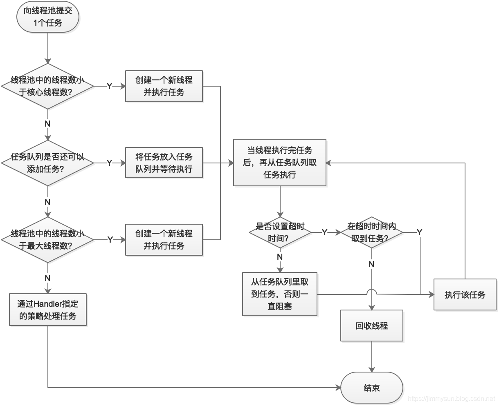
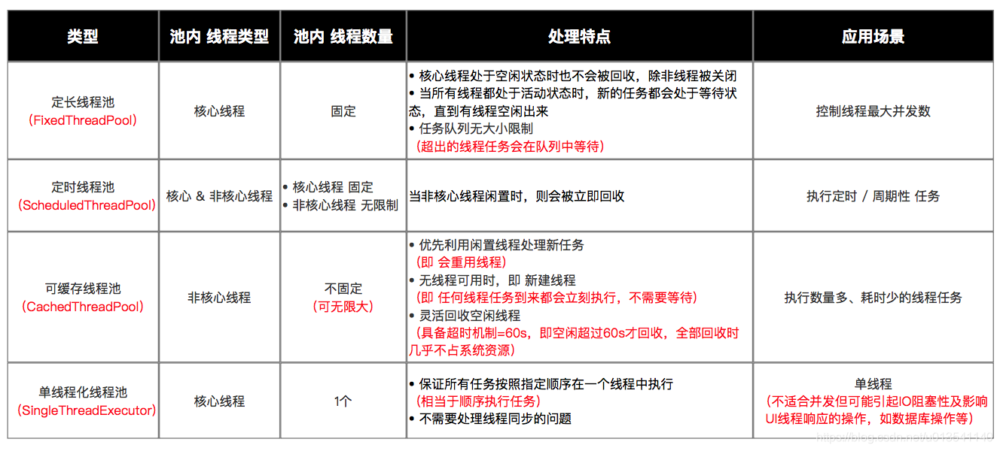

#线程池的优势
总体来说，线程池有如下的优势：
（1）降低资源消耗。通过重复利用已创建的线程降低线程创建和销毁造成的消耗。
（2）提高响应速度。当任务到达时，任务可以不需要等到线程创建就能立即执行。
（3）提高线程的可管理性。线程是稀缺资源，如果无限制的创建，不仅会消耗系统资源，还会降低系统的稳定性，使用线程池可以进行统一的分配，调优和监控。

#线程池的使用
线程池的真正实现类是 ThreadPoolExecutor,可以看到，其需要如下几个参数:
corePoolSize（必需）：核心线程数。默认情况下，核心线程会一直存活，但是当将allowCoreThreadTimeout设置为true时，核心线程也会超时回收。
maximumPoolSize（必需）：线程池所能容纳的最大线程数。当活跃线程数达到该数值后，后续的新任务将会阻塞。
keepAliveTime（必需）：线程闲置超时时长。如果超过该时长，非核心线程就会被回收。如果将allowCoreThreadTimeout设置为true时，核心线程也会超时回收。
unit（必需）：指定keepAliveTime参数的时间单位。常用的有：TimeUnit.MILLISECONDS（毫秒）、TimeUnit.SECONDS（秒）、TimeUnit.MINUTES（分）。
workQueue（必需）：任务队列。通过线程池的execute()方法提交的Runnable对象将存储在该参数中。其采用阻塞队列实现。
threadFactory（可选）：线程工厂。用于指定为线程池创建新线程的方式。
handler（可选）：拒绝策略。当达到最大线程数时需要执行的饱和策略。

#线程池的使用流程如下：
// 创建线程池
ThreadPoolExecutor threadPool = new ThreadPoolExecutor(CORE_POOL_SIZE,
        MAXIMUM_POOL_SIZE,
        KEEP_ALIVE,
        TimeUnit.SECONDS,
        sPoolWorkQueue,
        sThreadFactory);
// 向线程池提交任务
threadPool.execute(new Runnable() {
    @Override
    public void run() {
    ... // 线程执行的任务
    }
});
// 关闭线程池
threadPool.shutdown(); // 设置线程池的状态为SHUTDOWN，然后中断所有没有正在执行任务的线程
threadPool.shutdownNow(); // 设置线程池的状态为 STOP，然后尝试停止所有的正在执行或暂停任务的线程，并返回等待执行任务的列表

#线程池的工作原理
其工作原理流程图如下:

#线程池的参数
任务队列（workQueue）
任务队列是基于阻塞队列实现的，即采用生产者消费者模式，在Java中需要实现BlockingQueue接口。但Java已经为我们提供了7种阻塞队列的实现:
ArrayBlockingQueue：一个由数组结构组成的有界阻塞队列（数组结构可配合指针实现一个环形队列）。
LinkedBlockingQueue：一个由链表结构组成的有界阻塞队列，在未指明容量时，容量默认为Integer.MAX_VALUE。

PriorityBlockingQueue：一个支持优先级排序的无界阻塞队列，对元素没有要求， 
可以实现Comparable接口也可以提供Comparator来对队列中的元素进行比较。跟时间没有任何关系，仅仅是按照优先级取任务。

DelayQueue：类似于PriorityBlockingQueue，是二叉堆实现的无界优先级阻塞队列。要求元素都实现Delayed接口，
通过执行时延从队列中提取任务，时间没到任务取不出来。

SynchronousQueue：一个不存储元素的阻塞队列，消费者线程调用take()方法的时候就会发生阻塞，直到有一个生产者线程生产了一个元素，
消费者线程就可以拿到这个元素并返回；生产者线程调用put()方法的时候也会发生阻塞，直到有一个消费者线程消费了一个元素，生产者才会返回。

LinkedBlockingDeque：使用双向队列实现的有界双端阻塞队列。双端意味着可以像普通队列一样FIFO（先进先出），也可以像栈一样FILO（先进后出）。

LinkedTransferQueue：它是ConcurrentLinkedQueue、LinkedBlockingQueue和SynchronousQueue的结合体，
但是把它用在ThreadPoolExecutor中，和LinkedBlockingQueue行为一致，但是是无界的阻塞队列。 
>注意有界队列和无界队列的区别：如果使用有界队列，当队列饱和时并超过最大线程数时就会执行拒绝策略；而如果使用无界队列，
因为任务队列永远都可以添加任务，所以设置maximumPoolSize没有任何意义。

#拒绝策略（handler）
当线程池的线程数达到最大线程数时，需要执行拒绝策略。拒绝策略需要实现 RejectedExecutionHandler 接口，并
实现 rejectedExecution(Runnable r, ThreadPoolExecutor executor) 方法。不过 Executors 框架已经为我们实现了 4 种拒绝策略:

AbortPolicy（默认）：丢弃任务并抛出 RejectedExecutionException 异常。
CallerRunsPolicy：由调用线程处理该任务。
DiscardPolicy：丢弃任务，但是不抛出异常。可以配合这种模式进行自定义的处理方式。
DiscardOldestPolicy：丢弃队列最早的未处理任务，然后重新尝试执行任务。

#功能线程池
嫌上面使用线程池的方法太麻烦？其实Executors已经为我们封装好了 4 种常见的功能线程池，如下:
>>定长线程池（FixedThreadPool）:
> 特点：只有核心线程，线程数量固定，执行完立即回收，任务队列为链表结构的有界队列。
> 应用场景：控制线程最大并发数。

>>定时线程池（ScheduledThreadPool ）:
> 特点：核心线程数量固定，非核心线程数量无限，执行完闲置 10ms 后回收，任务队列为延时阻塞队列。
> 应用场景：执行定时或周期性的任务。

>>可缓存线程池（CachedThreadPool）:
> 特点：无核心线程，非核心线程数量无限，执行完闲置 60s 后回收，任务队列为不存储元素的阻塞队列。
> 应用场景：执行大量、耗时少的任务。

>>单线程化线程池（SingleThreadExecutor）:
> 特点：只有 1 个核心线程，无非核心线程，执行完立即回收，任务队列为链表结构的有界队列。
> 应用场景：不适合并发但可能引起 IO 阻塞性及影响 UI 线程响应的操作，如数据库操作、文件操作等。
#对比图

Executors 的 4 个功能线程池虽然方便，但现在已经不建议使用了，而是建议直接通过使用 ThreadPoolExecutor 的方式，
这样的处理方式让写的同学更加明确线程池的运行规则，规避资源耗尽的风险。
其实 Executors 的 4 个功能线程有如下弊端：
FixedThreadPool 和 SingleThreadExecutor：主要问题是堆积的请求处理队列均采用 LinkedBlockingQueue，
可能会耗费非常大的内存，甚至 OOM。
CachedThreadPool 和 ScheduledThreadPool：主要问题是线程数最大数是 Integer.MAX_VALUE，可能会创建数量非常多的线程，甚至 OOM。
