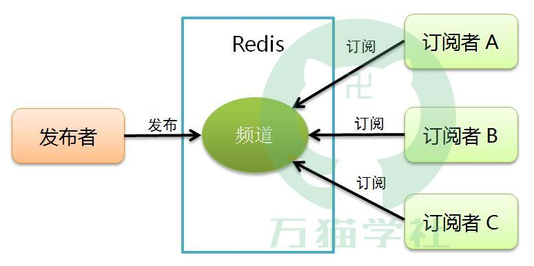

发布订阅简介 除了使用List实现简单的消息队列功能以外，Redis还提供了发布订阅的消息机制。在这种机制下，消息发布者向指定频道（channel）发布消息，消息订阅者可以收到指定频道的消息，同一个频道可以有多个消息订阅者，如下图：

Redis也提供了一些命令支持这个机制，接下来我们详细介绍一下这些命令。

发布订阅相关命令 在Redis中，发布订阅相关命令有： 发布消息 订阅频道 取消订阅 按照模式订阅 按照模式取消订阅 查询订阅信息 发布消息

发布消息的命令是publish，语法是： publish 频道名称 消息 比如，要向channel:one-more-study:demo频道发布一条消息“I am One More Study.”，命令如下：
> publish channel:one-more-study:demo "I am One More Study."
(integer) 0 返回的结果是订阅者的个数，上例中没有订阅者，所以返回结果为0。

订阅消息 订阅消息的命令是subscribe，订阅者可以订阅一个或者多个频道，语法是： subscribe 频道名称 [频道名称 ...]
比如，订阅一个channel:one-more-study:demo频道，命令如下：
> subscribe channel:one-more-study:demo Reading messages... (press Ctrl-C to quit)

1) "subscribe"
2) "channel:one-more-study:demo"
3) (integer) 1 返回结果中有3条，分别表示：返回值的类型（订阅成功）、订阅的频道名称、目前已订阅的频道数量。当订阅者接受到消息时，就会显示：
1) "message"
2) "channel:one-more-study:demo"
3) "I am One More Study."
   同样也是3条结果，分别表示：返回值的类型（信息）、消息来源的频道名称、消息内容。 新开启的订阅者，是无法收到该频道之前的历史消息的，因为Redis没有对发布的消息做持久化。

取消订阅 取消订阅的命令是unsubscribe，可以取消一个或者多个频道的订阅，语法是： unsubscribe [频道名称 [频道名称 ...]]
比如，取消订阅channel:one-more-study:demo频道，命令如下：
> unsubscribe channel:one-more-study:demo

1) "unsubscribe"
2) "channel:one-more-study:demo"
3) (integer) 0 返回结果中有3条，分别表示：返回值的类型（取消订阅成功）、取消订阅的频道名称、目前已订阅的频道数量。

按模式订阅消息 按模式订阅消息的命令是psubscribe，订阅一个或多个符合给定模式的频道，语法是： psubscribe 模式 [模式 ...]
每个模式以 * 作为匹配符，比如 channel* 匹配所有以 channel 开头的频道，命令如下：
> psubscribe channel:*
Reading messages... (press Ctrl-C to quit)

1) "psubscribe"
2) "channel*"
3) (integer) 1 返回结果中有3条，分别表示：返回值的类型（按模式订阅成功）、订阅的模式、目前已订阅的模式数量。当订阅者接受到消息时，就会显示：
1) "pmessage"
2) "channel*"
3) "channel:one-more-study:demo"
4) "I am One More Study."
   返回结果中有4条，分别表示：返回值的类型（信息）、消息匹配的模式、消息来源的频道名称、消息内容。

按模式取消订阅 按模式取消订阅的命令是punsubscribe，可以取消一个或者多个模式的订阅，语法是： punsubscribe [模式 [模式 ...]]
每个模式以 * 作为匹配符，比如 channel:* 匹配所有以 channel 开头的频道，命令如下： 1> punsubscribe channel:*

1) "punsubscribe"
2) "channel:*"
3) (integer) 0 返回结果中有3条，分别表示：返回值的类型（按模式取消订阅成功）、取消订阅的模式、目前已订阅的模式数量。

   查询订阅信息:

查看活跃频道 活跃频道指的是至少有一个订阅者的频道，语法是： pubsub channels [模式]
比如：
> pubsub channels

1) "channel:one-more-study:test"
2) "channel:one-more-study:demo"
3) "channel:demo"

> pubsub channels *demo

1) "channel:one-more-study:demo"
2) "channel:demo"

> pubsub channels *one-more-study*

1) "channel:one-more-study:test"
2) "channel:one-more-study:demo"

   查看频道订阅数 pubsub numsub [频道名称 ...]
   比如：

> pubsub numsub channel:one-more-study:demo

1) "channel:one-more-study:demo"
2) (integer) 1

   查看模式订阅数

> pubsub numpat
(integer) 1

Redis 发布订阅功能的特性 消息的发送者与接收者之间通过 channel 绑定：channel 可以是确定的字符串，也可以基于模式匹配 客户端可以订阅任意多个 channel 发送者发送的消息无法持久化，所以可能会造成消息丢失
由于消息无法持久化，所以，消费者无法收到在订阅 channel 之间发送的消息 发送者与客户端之间的消息发送与接收不存在 ACK 机制
Redis 发布订阅功能的适用场景 由于没有消息持久化与 ACK 的保证，所以，Redis 的发布订阅功能并不可靠。这也就导致了它的应用场景很有限，建议用于实时与可靠性要求不高的场景。例如：

消息推送 内网环境的消息通知 ... 总之，Redis 发布订阅功能足够简单，如果没有过多的要求，且不想搭建 Kafka、RabbitMQ 这样的可靠型消息系统时，可以考虑尝试使用 Redis。

Redis 发布订阅功能在 SpringBoot 中的关键类

Spring Data Redis 实现发布订阅功能非常简单，只有这样的几个类：Topic、MessageListener、RedisMessageListenerContainer。 下面对它们进行解释：

org.springframework.data.redis.listener.Topic 消息发送者与接收者之间的 channel 定义，有两个实现类：
org.springframework.data.redis.listener.ChannelTopic：一个确定的字符串
org.springframework.data.redis.listener.PatternTopic：基于模式匹配

org.springframework.data.redis.connection.MessageListener 一个回调接口，消息监听器，用于接收发送到 channel 的消息，接口定义如下：

package org.springframework.data.redis.connection; import org.springframework.lang.Nullable; public interface
MessageListener { void onMessage(Message message, @Nullable byte[] pattern); }
org.springframework.data.redis.listener.RedisMessageListenerContainer 用于消息监听，需要将 Topic 和 MessageListener 注册到
RedisMessageListenerContainer 中。这样，当 Topic 上有消息时，由 RedisMessageListenerContainer 通知 MessageListener，客户端通过 onMessage
拿到消息后，自行处理。