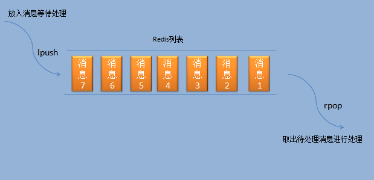

Redis用作消息队列
Redis不仅可作为缓存服务器，还可用作消息队列。它的列表类型天生支持用作消息队列。如下图所示：

由于Redis的列表是使用双向链表实现的，保存了头尾节点，所以在列表头尾两边插取元素都是非常快的。
所以可以直接使用Redis的List实现消息队列，只需简单的两个指令lpush和rpop或者rpush和lpop。

Redis实现消息队列的两种方式
①、Redis队列模式 (此章节重点讲述)
②、Redis发布订阅模式

redis队列模式(两种命令方式，均满足 先进先出 的队列模式)
①、lpush   rpop ：非阻塞式     
②、lpush   brpop ：阻塞式    ( 推荐此种方式 )    

举个例子：
brpop list1 list2 list3
就如list1位空的话，list2和list3为非空。 brpop 会返回 list2尾部的一个值。
否则，如何三个都一直为空的话，会一直阻塞。直到有lpush和rpush的操作。
如果设定了timeout的话，在timeout结束的时候，会解除阻塞。

Redis Rpop 命令用于移除列表的最后一个元素，返回值为移除的元素。brpop是rpop的阻塞版本。
Redis Brpop 命令移出并获取列表的最后一个元素， 如果列表没有元素会阻塞列表直到等待超时或发现可弹出元素为止。