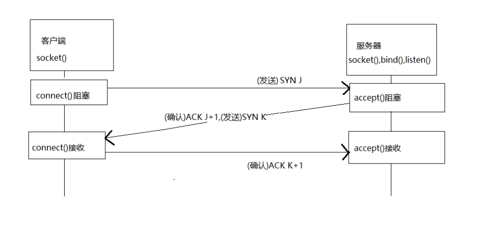
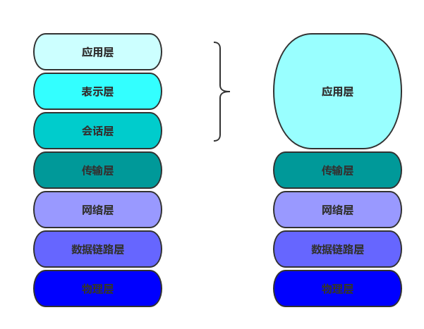

#Socket的实现流程
服务器:
        a.socket()创建socket对象
        b.bind()为socket对象绑定协议,赋予名字
        c.listen()监听此socket,将socket从默认主动类型改为被动类型
客户端:
        a.socket()创建一个socket对象
        b.connect()连接服务器的socket对象

#连接过程(TCP)
三次握手连接

#通信过程
服务器,客户端都可使用read(),write()等函数

#释放过程(TCP)
四次握手释放

#TCP/IP五层模型
TCP/IP五层协议（物理层、数据链路层、网络层、传输层、应用层）

#socket网络编程
1什么是socket?
Socket的英文原义是“孔”或“插座”。在网络编程中，网络上的两个程序通过一个双向的通信连接实现数据的交换，这个连接的一端称为一个socket。
Socket套接字是通信的基石，是支持TCP/IP协议的网络通信的基本操作单元。它是网络通信过程中端点的抽象表示，包含进行网络通信必须的五种信息：连接使用的协议，本地主机的IP地址，本地进程的协议端口，远地主机的IP地址，远地进程的协议端口。
Socket本质是编程接口(API)，对TCP/IP的封装，TCP/IP也要提供可供程序员做网络开发所用的接口，这就是Socket编程接口；HTTP是轿车，提供了封装或者显示数据的具体形式；Socket是发动机，提供了网络通信的能力。

2 Socket的原理
Socket实质上提供了进程通信的端点。进程通信之前，双方首先必须各自创建一个端点，否则是没有办法建立联系并相互通信的。正如打电话之前，双方必须各自拥有一台电话机一样。
套接字之间的连接过程可以分为三个步骤：服务器监听，客户端请求，连接确认。
1、服务器监听：是服务器端套接字并不定位具体的客户端套接字，而是处于等待连接的状态，实时监控网络状态。
2、客户端请求：是指由客户端的套接字提出连接请求，要连接的目标是服务器端的套接字。为此，客户端的套接字必须首先描述它要连接的服务器的套接字，指出服务器端套接字的地址和端口号，然后就向服务器端套接字提出连接请求。
3、连接确认：是指当服务器端套接字监听到或者说接收到客户端套接字的连接请求，它就响应客户端套接字的请求，建立一个新的线程，把服务器端套接字的描述发给客户端，一旦客户端确认了此描述，连接就建立好了。而服务器端套接字继续处于监听状态，继续接收其他客户端套接字的连接请求。

3 基于java的socket网络编程实现
Server端Listen监听某个端口是否有连接请求，Client端向Server 端发出连接请求，Server端向Client端发回Accept接受消息。这样一个连接就建立起来了。Server端和Client端都可以通过Send，Write等方法与对方通信。
对于一个功能齐全的Socket，都要包含以下基本结构，其工作过程包含以下四个基本的步骤：
1、创建Socket；
2、打开连接到Socket的输入/出流；
3、按照一定的协议对Socket进行读/写操作；
4、关闭Socket。
ServerSocket用于服务器端，Socket是建立网络连接时使用的

#TCP       
TCP（Transmission Control Protocol 传输控制协议）是一种面向连接的、可靠的、基于字节流的传输层通信协议.
TCP是（Tranfer Control Protocol）的简称，是一种面向连接的保证可靠传输的协议。
通过TCP协议传输，得到的是一个顺序的无差错的数据流。发送方和接收方的成对的两个socket之间必须建立连接，
当一个socket（通常都是server socket）等待建立连接时，另一个socket可以要求进行连接，一旦这两个socket连接起来，
它们就可以进行双向数据传输，双方都可以进行发送或接收操作。
#TCP的三次握手
建立起一个TCP连接需要经过“三次握手”：第一次握手：客户端发送syn包(syn=j)到服务器，并进入SYN_SEND状态，等待服务器确认；
第二次握手：服务器收到syn包，必须确认客户的SYN（ack=j+1），同时自己也发送一个SYN包（syn=k），即SYN+ACK包，
此时服务器进入SYN_RECV状态；第三次握手：客户端收到服务器的SYN＋ACK包，向服务器发送确认包ACK(ack=k+1)，此包发送完毕，
客户端和服务器进入ESTABLISHED状态，完成三次握手。
握手过程中传送的包里不包含数据，三次握手完毕后，客户端与服务器才正式开始传送数据。理想状态下，TCP连接一旦建立，
在通信双方中的任何一方主动关闭连接之前，TCP 连接都将被一直保持下去。断开连接时服务器和客户端均可以主动发起断开TCP连接的请求。

#TCP/IP协议
TCP/IP协议是目前应用最为广泛的协议，是构成Internet国际互联网协议的最为基础的协议,由TCP和IP协议组成:
TCP协议:面向连接的、可靠的、基于字节流的传输层通信协议，负责数据的可靠性传输的问题。
IP协议:用于报文交换网络的一种面向数据的协议，主要负责给每台网络设备一个网络地址，保证数据传输到正确的目的地。

#UDP协议
UDP特点：无连接、不可靠、基于报文的传输层协议，优点是发送后不用管，速度比TCP快。

