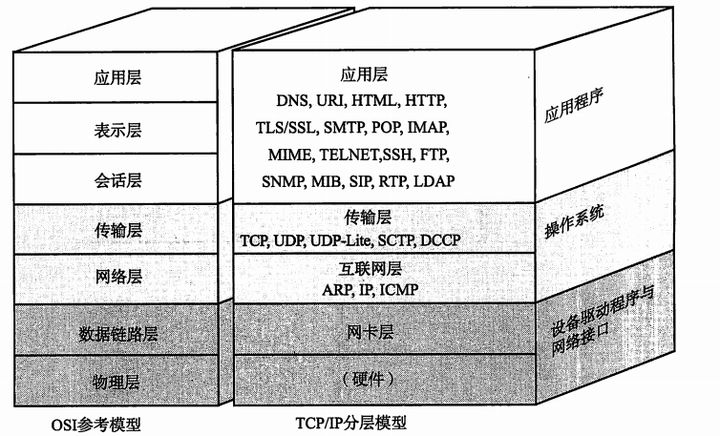
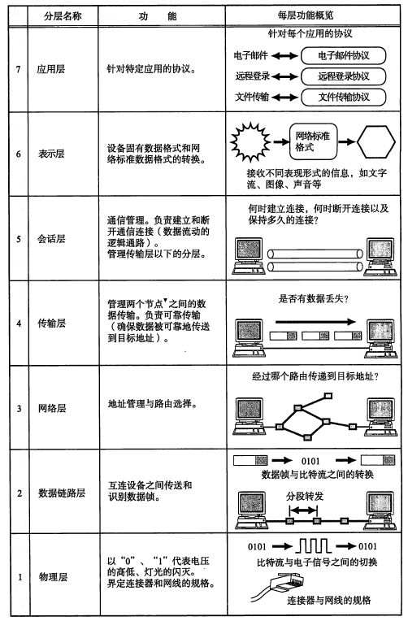
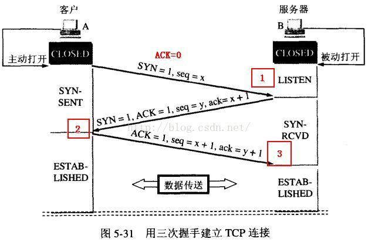
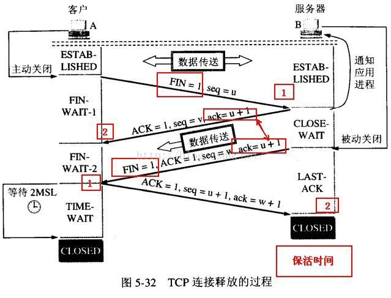
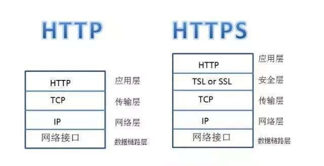

#Socket的实现流程
服务器:
        a.socket()创建socket对象
        b.bind()为socket对象绑定协议,赋予名字
        c.listen()监听此socket,将socket从默认主动类型改为被动类型
客户端:
        a.socket()创建一个socket对象
        b.connect()连接服务器的socket对象

#连接过程(TCP)
三次握手连接

#通信过程
服务器,客户端都可使用read(),write()等函数

#释放过程(TCP)
四次握手释放

#TCP/IP五层模型 OSI参考模型
TCP/IP五层协议（物理层、数据链路层、网络层、传输层、应用层）

应用层
应用层为操作系统或网络应用程序提供访问网络服务的接口。应用层协议的代表包括：Telnet、FTP、HTTP、SNMP等。
表示层
将应用处理的信息转换为适合网络传输的格式，或将来自下一层的数据转换为上层能够处理的格式。数据的表示、安全、压缩。
会话层
负责建立和断开通信连接（数据流动的逻辑通路），以及数据的分割等数据传输相关的管理。
传输层
管理两个节点之间的数据传输。负责可靠传输（确保数据被可靠地传送到目标地址）。
网络层
地址管理与路由选择, 在这一层，数据的单位称为数据包（packet）（路由器）。
数据链路层
互连设备之间传送和识别数据帧（交换机）。
物理层
以"0"、 "1"代表电压的高低，灯光的闪灭，在这一层，数据的单位称为比特（bit）,（中继器、集线器、还有我们通常说的双绞线也工作在物理层）。

#socket网络编程
1什么是socket?
Socket的英文原义是“孔”或“插座”。在网络编程中，网络上的两个程序通过一个双向的通信连接实现数据的交换，这个连接的一端称为一个socket。
Socket套接字是通信的基石，是支持TCP/IP协议的网络通信的基本操作单元。它是网络通信过程中端点的抽象表示，包含进行网络通信必须的五种信息：连接使用的协议，本地主机的IP地址，本地进程的协议端口，远地主机的IP地址，远地进程的协议端口。
Socket本质是编程接口(API)，对TCP/IP的封装，TCP/IP也要提供可供程序员做网络开发所用的接口，这就是Socket编程接口；HTTP是轿车，提供了封装或者显示数据的具体形式；Socket是发动机，提供了网络通信的能力。

2 Socket的原理
Socket实质上提供了进程通信的端点。进程通信之前，双方首先必须各自创建一个端点，否则是没有办法建立联系并相互通信的。正如打电话之前，双方必须各自拥有一台电话机一样。
套接字之间的连接过程可以分为三个步骤：服务器监听，客户端请求，连接确认。
1、服务器监听：是服务器端套接字并不定位具体的客户端套接字，而是处于等待连接的状态，实时监控网络状态。
2、客户端请求：是指由客户端的套接字提出连接请求，要连接的目标是服务器端的套接字。为此，客户端的套接字必须首先描述它要连接的服务器的套接字，指出服务器端套接字的地址和端口号，然后就向服务器端套接字提出连接请求。
3、连接确认：是指当服务器端套接字监听到或者说接收到客户端套接字的连接请求，它就响应客户端套接字的请求，建立一个新的线程，把服务器端套接字的描述发给客户端，一旦客户端确认了此描述，连接就建立好了。而服务器端套接字继续处于监听状态，继续接收其他客户端套接字的连接请求。

3 基于java的socket网络编程实现
Server端Listen监听某个端口是否有连接请求，Client端向Server 端发出连接请求，Server端向Client端发回Accept接受消息。这样一个连接就建立起来了。Server端和Client端都可以通过Send，Write等方法与对方通信。
对于一个功能齐全的Socket，都要包含以下基本结构，其工作过程包含以下四个基本的步骤：
1、创建Socket；
2、打开连接到Socket的输入/出流；
3、按照一定的协议对Socket进行读/写操作；
4、关闭Socket。
ServerSocket用于服务器端，Socket是建立网络连接时使用的

#TCP       
TCP（Transmission Control Protocol 传输控制协议）是一种面向连接的、可靠的、基于字节流的传输层通信协议.
TCP是（Tranfer Control Protocol）的简称，是一种面向连接的保证可靠传输的协议。
通过TCP协议传输，得到的是一个顺序的无差错的数据流。发送方和接收方的成对的两个socket之间必须建立连接，
当一个socket（通常都是server socket）等待建立连接时，另一个socket可以要求进行连接，一旦这两个socket连接起来，
它们就可以进行双向数据传输，双方都可以进行发送或接收操作。

#同步 SYN (SYNchronization)
当 SYN = 1 的时候，表明这是一个请求连接报文段。 一般称携带 SYN 标志的 TCP 报文段为「同步报文段」。 
在 TCP 三次握手中的第一个报文就是同步报文段，在连接建立时用来同步序号。
对方若同意建立连接，则应在响应的报文段中使 SYN = 1 和 ACK = 1
#确认 ACK (Acknowlegemt)
当 ACK = 1 的时候，确认号（Acknowledgemt Number）有效。 一般称携带 ACK 标志的 TCP 报文段为「确认报文段」。
为0表示数据段不包含确认信息，确认号被忽略。
TCP 规定，在连接建立后所有传送的报文段都必须把 ACK 设置为 1。

#TCP的三次握手
用三次握手建立TCP链接

建立起一个TCP连接需要经过“三次握手”：第一次握手：客户端发送syn包(syn=j)到服务器，并进入SYN_SEND状态，等待服务器确认；
第二次握手：服务器收到syn包，必须确认客户的SYN（ack=j+1），同时自己也发送一个SYN包（syn=k），即SYN+ACK包，
此时服务器进入SYN_RECV状态；第三次握手：客户端收到服务器的SYN＋ACK包，向服务器发送确认包ACK(ack=k+1)，此包发送完毕，
客户端和服务器进入ESTABLISHED状态，完成三次握手。
握手过程中传送的包里不包含数据，三次握手完毕后，客户端与服务器才正式开始传送数据。理想状态下，TCP连接一旦建立，
在通信双方中的任何一方主动关闭连接之前，TCP 连接都将被一直保持下去。断开连接时服务器和客户端均可以主动发起断开TCP连接的请求。
#TCP的四次握手 释放链接
TCP释放的过程
    
#为什么要等待呢？
为了这种情况： B向A发送 FIN = 1 的释放连接请求，但这个报文丢失了， A没有接到不会发送确认信息， B 超时会重传，
这时A在 WAIT_TIME 还能够接收到这个请求，这时再回复一个确认就行了。（A收到 FIN = 1 的请求后 WAIT_TIME会重新记时）
#为什么连接的时候是三次握手，关闭的时候却是四次握手？
答：因为当Server端收到Client端的SYN连接请求报文后，可以直接发送SYN+ACK报文。其中ACK报文是用来应答的，SYN报文是用来同步的。
但是关闭连接时，当Server端收到FIN报文时，很可能并不会立即关闭SOCKET，所以只能先回复一个ACK报文，告诉Client端，"你发的FIN报文我收到了"。
只有等到我Server端所有的报文都发送完了，我才能发送FIN报文，因此不能一起发送。故需要四步握手。

#TCP/IP协议
TCP/IP协议是目前应用最为广泛的协议，是构成Internet国际互联网协议的最为基础的协议,由TCP和IP协议组成:
TCP协议:面向连接的、可靠的、基于字节流的传输层通信协议，负责数据的可靠性传输的问题。
IP协议:用于报文交换网络的一种面向数据的协议，主要负责给每台网络设备一个网络地址，保证数据传输到正确的目的地。

#UDP协议
UDP特点：无连接、不可靠、基于报文的传输层协议，优点是发送后不用管，速度比TCP快。

#Websocket&Socket
#Socket
简单理解：Socket = IP地址 + 端口 + 协议。
具体来说，Socket是一套标准，它完成了对TCP/IP的高度封装，屏蔽网络细节以方便开发者更好地进行网络编程。
#WebSocket
WebSocket是一个持久化的协议，它是伴随HTTP5而出的协议，用来解决http不支持持久化连接的问题。
总之，WebSocket和Socket其实是两个东西，Socket一个是网编编程的标准接口，而WebSocket是应用层通信协议。

但是，说WebSocket与Socket的差异更多说的是：WebSocket与HTTP无状态被动协议的差异，
或者说是WebSocket与Ajax轮询和long poll等实现实时信息传输方式的差异，这也是本文需要讨论的问题。
HTTP协议是被动的无状态协议，一个Request对应一个Response，每次Request， 客户端都需要重复带上用于鉴别客户端身份的信息到服务端， 
且服务端无法主动推送消息给客户端。 针对HTTP这种效率低、响应不及时、浪费通信带宽和服务端资源的情况，WebSocket应运而生，
WebSocket采用一次请求，持久连接方式解决了反复校验客户端身份问题，服务端建立连接后可以主动推送消息给客户端，因此通信效率大大增加，
同时也节约了客户端、服务端和网络资源。

#Http与Https

网站的URL会分为两部分：通信协议和域名地址。域名地址都很好理解，不同的域名地址表示网站中不同的页面，
而通信协议，简单来说就是浏览器和服务器之间沟通的语言。网站中的通信协议一般就是HTTP协议和HTTPS协议。
#Http协议
HTTP协议也就是超文本传输协议，是一种使用明文数据传输的网络协议。 一直以来HTTP协议都是最主流的网页协议，
HTTP协议被用于在Web浏览器和网站服务器之间传递信息，以明文方式发送内容， 不提供任何方式的数据加密，
如果攻击者截取了Web浏览器和网站服务器之间的传输报文，就可以直接读懂其中的信息。
#Https协议
为了解决HTTP协议的这一缺陷，需要使用另一种协议：安全套接字层超文本传输协议HTTPS，为了数据传输的安全，
HTTPS在HTTP的基础上加入了SSL/TLS协议， SSL/TLS依靠证书来验证服务器的身份，并为浏览器和服务器之间的通信加密。
HTTPS协议可以理解为HTTP协议的升级，就是在HTTP的基础上增加了数据加密。 在数据进行传输之前，对数据进行加密，然后再发送到服务器。
这样，就算数据被第三者所截获，但是由于数据是加密的，所以你的个人信息仍然是安全的。 这就是HTTP和HTTPS的最大区别。
HTTPS协议是由SSL/TLS+HTTP协议构建的可进行加密传输、身份认证的网络协议，要比http协议安全。
#HTTP和HTTPS的区别

http：超文本传输协议，明文传输，信息不安全。用的是80端口
https：安全套接字超文本传输协议，有ssl/tsl证书，信息安全。用的443端口
1.安全性不同
https://前缀表明是用SSL (安全套接字)或TSL加密的，你的电脑与服务器之间收发的信息传输将更加安全。
当你使用浏览器访问一个HTTP网站的时候，你会发现浏览器会对该HTTP网站显示“不安全”的安全警告，提示用户当前所访问的网站可能会存在风险。
2.网站申请流程不同
https协议需要到CA申请证书，一般免费证书很少，需要交费，Web服务器启用SSL需要获得一个服务器证书并将该证书与要使用SSL的服务器绑定。
3.默认端口不同
http和https使用的是完全不同的连接方式，同时使用的端口也不同，http使用的是80端口，https使用的是443端口。
在网络模型中，HTTP工作于应用层，而HTTPS工作在传输层。
