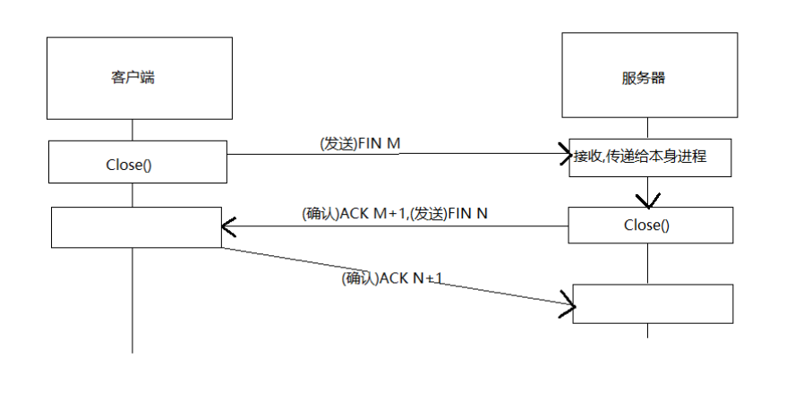

#Socket的实现流程
服务器:
        a.socket()创建socket对象
        b.bind()为socket对象绑定协议,赋予名字
        c.listen()监听此socket,将socket从默认主动类型改为被动类型
客户端:
        a.socket()创建一个socket对象
        b.connect()连接服务器的socket对象

#连接过程(TCP)
三次握手连接

#通信过程
服务器,客户端都可使用read(),write()等函数

#释放过程(TCP)
四次握手释放

