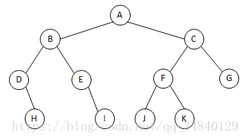
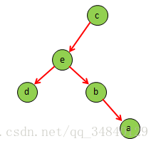
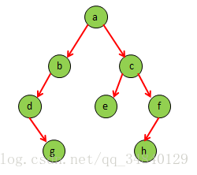

二叉树的遍历主要有三种：

（1）先(根)序遍历（根左右）

（2）中(根)序遍历（左根右）

（3）后(根)序遍历（左右根）

举个例子：

先(根)序遍历（根左右）：A B D H E I C F J K G

中(根)序遍历（左根右） : D H B E I A J F K C G

后(根)序遍历（左右根） : H D I E B J K F G C A

以后(根)序遍历为例，每次都是先遍历树的左子树，然后再遍历树的右子树，最后再遍历根节点，以此类推，直至遍历完整个树。

此外，还有一个命题：给定了二叉树的任何一种遍历序列，都无法唯一确定相应的二叉树。但是如果知道了二叉树的中序遍历序列和任意的另一种遍历序列，就可以唯一地确定二叉树。

例子1：已知二叉树的后序遍历序列是dabec,中序遍历序列是debac,它的前序遍历序列是（cedba）。

(1)中序遍历：debac

后序遍历：dabec

后序遍历序列的最后一个结点是根结点，所以可知c为根结点。

中序遍历序列的根结点在中间，其左边是左子树，右边是右子树。所以从中序遍历序列中可看出，根结点c只有左子树，没有 右子树。

(2)中序遍历：deba

后序遍历：dabe

后序遍历序列的最后一个结点是根结点，所以可知e为c的左子树的根结点。

中序遍历序列的根结点在中间，其左边是左子树，右边是右子树。所以从中序遍历序列中可看出，根结点e的左子结点是d，右子树是ba。

(3)中序遍历：ba

后序遍历：ab

由后序遍历序列可知b为e的右子树的根结点。由中序遍历序列中可看出，a为根结点b的右子结点。

树的结构如下：

例子2：已知二叉树的前序遍历序列是abdgcefh,中序遍历序列是dgbaechf,它的前序遍历序列是（gdbehfca）。

(1)先序遍历：abdgcefh

中序遍历：dgbaechf

先序遍历序列的第一个结点是根结点，所以可知a为根结点。

中序遍历序列的根结点在中间，其左边是左子树，右边是右子树。所以从中序遍历序列中可看出，根结点a的左子树是dgb，右子树是echf。

a的左子树：

(2)先序遍历：bdg

中序遍历：dgb

先序遍历序列的第一个结点是根结点，所以可知b为a的左子树的根结点。

中序遍历序列的根结点在中间，其左边是左子树，右边是右子树。所以从中序遍历序列中可看出，根结点b的左子树是dg，没有右子树。

b的左子树：

(3)先序遍历：dg

中序遍历：dg

由先序遍历序列可知d为b的左子树的根结点。

中序遍历序列的根结点在中间，其左边是左子树，右边是右子树。所以从中序遍历序列中可看出，根结点d的右子结点是g。

a的右子树：

(4)先序遍历：cefh

中序遍历：echf

由先序遍历序列可知c为a的右子树的根结点。

从中序遍历序列中可看出，根结点c的左子结点是e，右子树是hf。

c的右子树：

(5)先序遍历：fh

中序遍历：hf

由先序遍历序列可知f为c的右子树的根结点。

从中序遍历序列中可看出，根结点f的左子结点是h，没有右子树。

树的结构如下：

