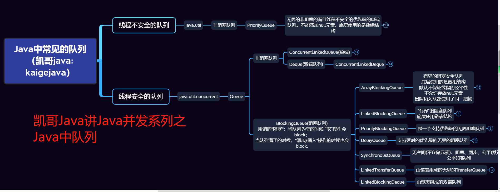
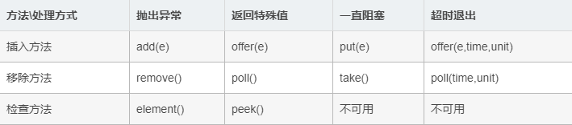

下表显示了jdk1.5中的阻塞队列的操作：

add        增加一个元索                     如果队列已满，则抛出一个IIIegaISlabEepeplian异常  
remove   移除并返回队列头部的元素    如果队列为空，则抛出一个NoSuchElementException异常  
element  返回队列头部的元素             如果队列为空，则抛出一个NoSuchElementException异常  
offer       添加一个元素并返回true       如果队列已满，则返回false  
poll         移除并返问队列头部的元素    如果队列为空，则返回null  
peek       返回队列头部的元素             如果队列为空，则返回null  
put         添加一个元素                      如果队列满，则阻塞  
take        移除并返回队列头部的元素     如果队列为空，则阻塞    

remove、element、offer 、poll、peek 其实是属于Queue接口。

阻塞队列的操作可以根据它们的响应方式分为以下三类：aad、removee和element操作在你试图为一个已满的队列增加元素或从空队列取得元素时 抛出异常。当然，在多线程程序中，队列在任何时间都可能变成满的或空的，所以你可能想使用offer、poll、peek方法。这些方法在无法完成任务时 只是给出一个出错示而不会抛出异常。  
注意：poll和peek方法出错进返回null。因此，向队列中插入null值是不合法的  
最后，我们有阻塞操作put和take。put方法在队列满时阻塞，take方法在队列空时阻塞。  

队列Queue是一个先进先出的数据结构
Queue的实现:
阻塞队列（BolckingQueue）  非阻塞队列

阻塞队列（BolckingQueue）

一、插入与移除

1、插入

队列不满时可执行插入元素线程，直到队列满。

2、移除

队列不为空时都可移除，直到队列为空。

抛出异常：满的时候插入，空的时候取出都会抛出异常。

返回特殊值：插入成功返回true

一直阻塞：满时put和空时take会阻塞线程，直到队列可用。

二、JDK7提供了7个阻塞队列

1、ArrayListBlockingQueue

ArrayBlockingQueue是一个由数组支持的有界阻塞队列。在读写操作上都需要锁住整个容器，因此吞吐量与一般的实现是相似的，适合于实现“生产者消费者”模式。
ArrayBlockingQueue在构造时需要指定容量， 并可以选择是否需要公平性，如果公平参数被设置true，等待时间最长的线程会优先得到处理（其实就是通过将ReentrantLock设置为true来 达到这种公平性的：即等待时间最长的线程会先操作）。通常，公平性会使你在性能上付出代价，只有在的确非常需要的时候再使用它。它是基于数组的阻塞循环队 列，此队列按 FIFO（先进先出）原则对元素进行排序。

2、LinkedBlockingQueue

一个由链表结构组成的双向阻塞队列。

LinkedBlockingQueue之所以能够高效的处理并发数据，还因为其对于生产者和消费者分别采用了独立的锁来控制数据同步，也就意味着在高并发的情况下生产者和消费者可以并行的操作队列中的数据，以此来提高整个队列的并发性能。
LinkedBlockingQueue的容量是没有上限的（说的不准确，在不指定时容量为Integer.MAX_VALUE，不要然的话在put时怎么会受阻呢），但是也可以选择指定其最大容量，它是基于链表的队列，此队列按 FIFO（先进先出）排序元素。

3、SynchronousQueue

一个不存储元素的阻塞队列，在某次添加元素后必须等待其他线程取走后才能继续添加。

4、 PriorityBlockingQueue

是一个带优先级的队列，而不是先进先出队列，该队列也没有上限，但是如果队列为空，那么取元素的操作take就会阻塞。

5、DelayQueue

是一个存放Delayed 元素的无界阻塞队列，只有在延迟期满时才能从中提取元素。

三、ArrayListBlockingQueue和LinkedBlockingQueue的区别？

1、队列中锁的实现不同

ArrayBlockingQueue生产者消费者使用同一个锁。

LinkedBlockingQueue生产用的是putLock，消费是takeLock。

2、在生产和消费时操作不同

ArrayBlockingQueue实现的队列中在生产和消费的时候，是直接将枚举对象插入或移除的；

LinkedBlockingQueue实现的队列中在生产和消费的时候，需要把枚举对象转换为节点进行插入或移除，会影响性能。

3、 队列大小初始化方式不同

ArrayBlockingQueue实现的队列必须指定大小

LinkedBlockingQueue可以不指定大小，默认是Integer.MAX_VALUE

ArrayBlockingQueue性能要比LinkedBlockingQueue性能要好，执行速度更快，ArrayBlockingQueue优先使用！

非阻塞队列

ConcurrentLinkedQueue是一个基于链接节点的无界线程安全队列，它采用先进先出的规则对节点进行排序，当我们添加一个元素的时候，它会添加到队列的尾部；当我们获取一个元素时，它会返回队列头部的元素。

入队和出队都采用CAS（compare and set）更新，这样允许多个线程并发执行，并且不会因为加锁而阻塞线程，使得并发性能更好。

注：CAS用于实现多线程同步的原子指令，它将内存位置的内容与给定值进行比较，只有在相同的情况下，将该内存位置的内容修改为新的给定值。
