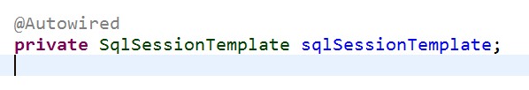
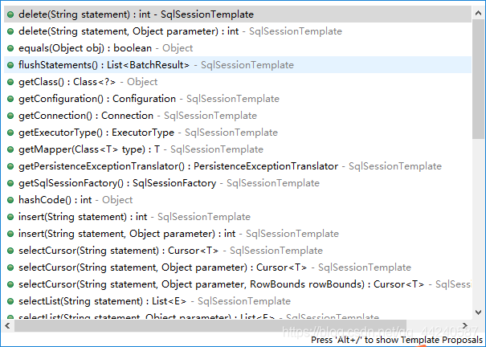

一、事务
事务管理在系统开发中是不可缺少的一部分，Spring提供了很好事务管理机制，主要分为编程式事务和声明式事务两种。
#编程式事务：是指在代码中手动的管理事务的提交、回滚等操作，代码侵入性比较强，如下示例：
try {
    //TODO something
    transactionManager.commit(status);
} catch (Exception e) {
    transactionManager.rollback(status);
    throw new InvoiceApplyException("异常失败");
}

    @GetMapping("/testTransactional")
    public Object testTransactional(){
        // 开启事务管理
        DefaultTransactionDefinition def = new DefaultTransactionDefinition();
        def.setPropagationBehavior(TransactionDefinition.PROPAGATION_REQUIRED);
        TransactionStatus status = txManager.getTransaction(def);
        //操作都放在异常处理块中
        try {
            //第一次操作
            StudyNote studyNote=new StudyNote();
            studyNote.setContent("事务测试第一次操作");
            studyNoteService.save(studyNote);
            //模拟出错
            String s[]=new String[3];
            System.out.println(s[10]);
            //第二次操作
            studyNote.setContent("事务测试第二次操作");
            studyNoteService.save(studyNote);
        }catch (Exception e){
            //出现异常进行回退
            txManager.rollback(status);
            log.error("系统内部错误", e);
            return ResponseUtil.fail();
        }
        txManager.commit(status);//事务提交
        return ResponseUtil.ok();
    }

#声明式事务：基于AOP面向切面的，它将具体业务与事务处理部分解耦，代码侵入性很低，所以在实际开发中声明式事务用的比较多。
#声明式事务也有两种实现方式，一是基于TX和AOP的xml配置文件方式，二种就是基于@Transactional注解了。
@Transactional
@GetMapping("/test")
public String test() {
    int insert = cityInfoDictMapper.insert(cityInfoDict);
}

二、事务详情
#事务特性
原子性（Atomicity）：事务是一个原子操作，由一系列动作组成。事务的原子性确保动作要么全部完成，要么完全不起作用；
一致性（Consistency）：一旦事务完成（不管是成功还是失败），系统必须确保它所建模的业务处于一致的状态，
而不会是部分完成部分失败。在现实中的数据不应该被破坏；
隔离性（Isolation）：可能有许多事务会同时处理相同的数据，因此每个事务都应该与其他事务隔离开来，防止数据损坏；
持久性（Durability）：一旦事务完成，无论发生什么系统错误，它的结果都不应该受到影响，这样就能从任何系统崩溃中恢复过来。
通常情况下，事务的结果被写到持久化存储器中；
#@Transactional介绍
1、@Transactional注解可以作用于哪些地方？
@Transactional 可以作用在接口、类、类方法。
作用于类：当把@Transactional 注解放在类上时，表示所有该类的 public 方法 都配置相同的事务属性信息。
作用于方法：当类配置了@Transactional，方法也配置了@Transactional，方法的事务会 覆盖 类的事务配置信息。
作用于接口：不推荐这种使用方法，因为一旦标注在Interface上并且配置了Spring AOP 使用CGLib动态代理，将会导致@Transactional注解失效

#SpringBoot事务注解@Transactional 事物回滚、手动回滚事物
处理springboot 下提交事务异常，数据库没有回滚的问题。
spring的文档中说道，spring声明式事务管理默认对非检查型异常和运行时异常进行事务回滚，而对检查型异常则不进行回滚操作。

什么是检查型异常什么又是非检查型异常？
最简单的判断点有两个：
1.继承自runtimeexception或error的是非检查型异常，而继承自exception的则是检查型异常（当然，runtimeexception本身也是exception的子类）。
2.对非检查型类异常可以不用捕获，而检查型异常则必须用try语句块进行处理或者把异常交给上级方法处理总之就是必须写代码处理它。
所以必须在service捕获异常，然后再次抛出，这样事务方才起效。
结论：
在spring的事务管理环境下，使用unckecked exception可以极大地简化异常的处理，只需要在事务层声明可能抛出的异常
（这里的异常可以是自定义的unckecked exception体系），在所有的中间层都只是需要简单throws即可，不需要捕捉和处理，直接到最高层，
比如UI层再进行异常的捕捉和处理。
默认规则：
1 让checked例外也回滚： @Transactional(rollbackFor=Exception.class)，一般只需添加这个即可
2 让unchecked例外不回滚： @Transactional(notRollbackFor=RunTimeException.class)
3 不需要事务管理的(只查询的)方法：@Transactional(propagation=Propagation.NOT_SUPPORTED)，或者不添加
注意： 如果异常被try｛｝catch｛｝了，事务就不回滚了，如果想让事务回滚必须再往外抛try｛｝catch｛throw Exception｝。
因为一旦你try｛｝catch｛｝了。系统会认为你已经手动处理了异常，就不会进行回滚操作。
#spring 事务控制 设置手动回滚 TransactionAspectSupport.currentTransactionStatus().setRollbackOnly();
这个需要注意两点：
1. 方法上要加上@Transactional(rollbackFor = Exception.class)
   再配合TransactionAspectSupport.currentTransactionStatus().setRollbackOnly(); 才可以
2. 在web项目中，很多时候要用到@Transactional 注解方法或者类进行事务处理，自动事务提交有时候就会有问题，这个时候就要用到手动进行事务提交，
   在try catch 异常抛出里面手动回滚事务处理TransactionAspectSupport.currentTransactionStatus().setRollbackOnly();
使用Object savePoint = TransactionAspectSupport.currentTransactionStatus().createSavepoint(); 设置回滚点，
使用TransactionAspectSupport.currentTransactionStatus().rollbackToSavepoint(savePoint);回滚到savePoint。

##@Transactional失效场景
#@Transactional 应用在非 public 修饰的方法上
#@Transactional 注解属性 propagation 设置错误
#@Transactional  注解属性 rollbackFor 设置错误
#同一个类中方法调用，导致 @Transactional 失效
开发中避免不了会对同一个类里面的方法调用，比如有一个类Test，它的一个方法A，A再调用本类的方法B（不论方法B是用public还是private修饰），
但方法A没有声明注解事务，而B方法有。则外部调用方法A之后，方法B的事务是不会起作用的。这也是经常犯错误的一个地方。
那为啥会出现这种情况？其实这还是由于使用 Spring AOP 代理造成的，因为 只有当事务方法被 当前类以外的代码 调用时，
才会由Spring生成的代理对象来管理。
#异常被你的 catch“吃了”导致 @Transactional 失效
#数据库引擎不支持事务
这种情况出现的概率并不高，事务能否生效数据库引擎是否支持事务是关键。常用的MySQL数据库默认使用支持事务的innodb引擎。
一旦数据库引擎切换成不支持事务的myisam，那事务就从根本上失效了。

#事务隔离级别：指若干个并发的事务之间的隔离程度，TransactionDefinition接口中定义了5个表示隔离级别的常量
TransactionDefinition.ISOLATION_DEFAULT：默认值-1，表示使用底层数据库的默认隔离级别，对大部分数据库而言，通常这值就是TransactionDefinition.ISOLATION_READ_COMMITTED；
TransactionDefinition.ISOLATION_READ_UNCOMMITTED：该隔离级别表示一个事务可以读取另一个事务修改但还没有提交的数据，该级别可能导致脏读、不可重复读和幻读，因此很少使用该隔离级别，比如PostgreSQL实际上并没有此级别；
TransactionDefinition.ISOLATION_READ_COMMITTED：（Oracle默认级别）该隔离级别表示一个事务只能读取另一个事务已经提交的数据，即允许从已经提交的并发事务读取，该级别可以防止脏读，但幻读和不可重复读仍可能会发生；
TransactionDefinition.ISOLATION_REPEATABLE_READ：（MySQL默认级别）该隔离级别表示一个事务在整个过程中可以多次重复执行某个查询，并且每次返回的记录都相同，即对相同字段的多次读取的结果是一致的，除非数据被当前事务本事改变。该级别可以防止脏读和不可重复读，但幻读仍可能发生；
TransactionDefinition.ISOLATION_SERIALIZABLE：（完全服从ACID的隔离级别）所有的事务依次逐个执行，这样事务之间就完全不可能产生干扰，也就是说，该级别可以防止脏读、不可重复读和幻读，但严重影响程序的性能，因为它通常是通过完全锁定当前事务所涉及的数据表来完成的；

脏读（Dirty read）：发生在一个事务读取了被另一个事务改写但尚未提交的数据时。如果这些改变在稍后被回滚了，那么第一个事务读取的数据就会是无效的；
不可重复读（Nonrepeatable read）：发生在一个事务执行相同的查询两次或两次以上，但每次查询结果都不相同时。这通常是由于另一个并发事务在两次查询之间更新了数据。（不可重复读重点在修改）；
幻读（Phantom reads）：幻读和不可重复读相似。当一个事务（T1）读取几行记录后，另一个并发事务（T2）插入了一些记录时，幻读就发生了。在后来的查询中，第一个事务（T1）就会发现一些原来没有的额外记录。（幻读重点在新增或删除）；

#事务传播机制：事务的传播性一般用在事务嵌套的场景，比如一个事务方法里面调用了另外一个事务方法，那么两个方法是各自作为独立的方法提交还是内层的事务合并到外层的事务一起提交，这就需要事务传播机制的配置来确定怎么样执行；在TransactionDefinition接口中定义了以下几个表示传播机制的常量，值为0~6：
TransactionDefinition.PROPAGATION_REQUIRED：默认值，能满足绝大部分业务需求，如果外层有事务，则当前事务加入到外层事务，一块提交，一块回滚。如果外层没有事务，新建一个事务执行；
TransactionDefinition.PROPAGATION_REQUIRES_NEW：该事务传播机制是每次都会新开启一个事务，同时把外层事务挂起，当当前事务执行完毕，恢复上层事务的执行。如果外层没有事务，执行当前新开启的事务即可；
TransactionDefinition.PROPAGATION_SUPPORTS：如果外层有事务，则加入外层事务；如果外层没有事务，则直接以非事务的方式继续运行。完全依赖外层的事务；
TransactionDefinition.PROPAGATION_NOT_SUPPORTED：该传播机制不支持事务，如果外层存在事务则挂起，执行完当前代码，则恢复外层事务，无论是否异常都不会回滚当前的代码；
TransactionDefinition.PROPAGATION_NEVER：该传播机制不支持外层事务，即如果外层有事务就抛出异常；
TransactionDefinition.PROPAGATION_MANDATORY：与NEVER相反，如果外层有事务，则加入外层事务，如果外层没有事务，则抛出异常；
TransactionDefinition.PROPAGATION_NESTED：该传播机制的特点是可以保存状态保存点，当前事务回滚到某一个点，从而避免所有的嵌套事务都回滚，即各自回滚各自的，如果子事务没有把异常吃掉，基本还是会引起全部回滚的；

传播机制回答了这样一个问题：一个新的事务应该被启动还是被挂起，或者是一个方法是否应该在事务性上下文中运行。
这里需要指出的是，前面的六种事务传播行为是 Spring 从 EJB 中引入的，他们共享相同的概念。而 PROPAGATION_NESTED是 Spring 所特有的。以 PROPAGATION_NESTED 启动的事务内嵌于外部事务中（如果存在外部事务的话），此时，内嵌事务并不是一个独立的事务，它依赖于外部事务的存在，只有通过外部的事务提交，才能引起内部事务的提交，嵌套的子事务不能单独提交。如果熟悉 JDBC 中的保存点（SavePoint）的概念，那嵌套事务就很容易理解了，其实嵌套的子事务就是保存点的一个应用，一个事务中可以包括多个保存点，每一个嵌套子事务。另外，外部事务的回滚也会导致嵌套子事务的回滚。
挂起事务，指的是将当前事务的属性如事务名称，隔离级别等属性保存在一个变量中，同时将当前线程中所有和事务相关的ThreadLocal变量设置为从未开启过线程一样。Spring维护着一个当前线程的事务状态，用来判断当前线程是否在一个事务中以及在一个什么样的事务中，挂起事务后，当前线程的事务状态就好像没有事务。

#SqlSessionTemplate简介
通俗地讲，SqlSessionTemplate是Mybatis—Spring的核心，是用来代替默认Mybatis实现的DefaultSqlSessionFactory，
也可以说是DefaultSqlSessionFactory的优化版，主要负责管理Mybatis的SqlSession，调用Mybatis的sql方法， SqlSessionTemplate是线程安全的，
通过TransactionSynchronizationManager中的ThreadLocal保存线程对应的SqlSession, 可以被多个Dao共享使用。

SqlSessionTemplate是个线称安全的类，每运行一个SqlSessionTemplate时，它就会重新获取一个新的SqlSession，
所以每个方法都有一个独立的SqlSession，这意味着它是线称安全的。
#SqlSessionTemplate实现方式
<dependency>
    <groupId>org.mybatis.spring.boot</groupId>
    <artifactId>mybatis-spring-boot-starter</artifactId>
    <version>1.3.1</version>
</dependency>
Mybatis里面有提供SqlSessionTemplate，由于SpringBoot都是用的注解的方式注入，
所以没有Spring-Mybatis.xml也就不需要配置，用Autowired直接自动注入即可。

#Mybatis 一级缓存、二级缓存
其中一级缓存默认是开启的，二级缓存是要手动配置开启的
#一级缓存
1：一级缓存是默认开启的；
2：底层其实是基于hashmap的本地内存缓存；
3：作用域是session（其实就相当于一个方法）；
4：当session关闭或者刷新的时候缓存清空；
5：不通sqlsession之间缓存互不影响；

问题一：其实一级缓存也有数据一致性问题：
比如：我有一个更新操作对同一条数据，
如果是sqlsessionA进行了更新操作，则sqlsessionA对应的一级缓存被清空；
如果是sqlsessionB进行了更新操作，则此更新操作对改sqlsessionA不可见；
那么其实这个时候sqlsessionA再查的数据就是过期失效数据了；
就出现了数据不一致现象；

建议：
1：单个sqlsession的生命周期不能过长；
2：如果是对同一个语句更新尽量使用同一个sql，也就是同一个sqlsession；
3：建议关闭一级缓存，
怎么关闭呢？
在mybatis的全局配置文件中增加

<settiog name="localCacheScope" value="STATEMENT" />

#二级缓存
1：首先mybatis默认是没有开启二级缓存的，
2：二级缓存需要我们手动开启，它是mapper级别的缓存；
3：同一个namespace下的所有操作语句，都影响着同一个Cache，即二级缓存被多个SqlSession共享，是一个全局的变量。

那怎么开启二级缓存呢？
<setting name="cacheEnabled" value="true"/>

使用二级缓存？
在标签<mapper>下面添加<cache/>
使用二级缓存的pojo类实现序列化接口；

当然二级缓存也不建议使用，mysql都默认关闭了，更何况我们呢；
因为二级缓存是建立在同一个namespace下的，如果对某一个表的操作查询可能有多个namespace，那么得到的数据就是有问题的；

建议：
1：对某个表的操作和查询都写在同一个namespace下，其他的namespace如果有操作就会有问题，脏数据；
2：对表的关联查询，关联的所有表的操作都必须在同一个namespace下；（这点在实际生产中简直太垃圾了，怎么可能呢）

总结
建议统一使用第三方插件来做缓存，如redis，mamcache等，
关闭mybatis的一级缓存和二级缓存，
mybatis仅仅只限于orm框架，数据库和对象的映射，以及操作sql；

